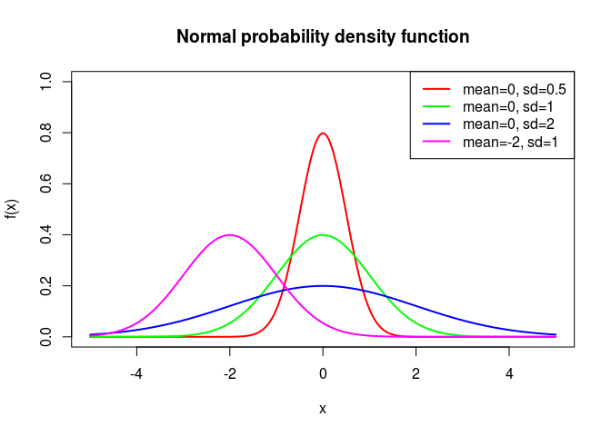
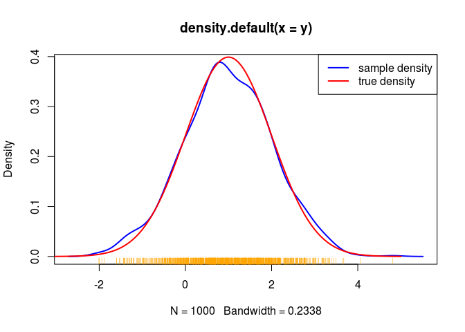
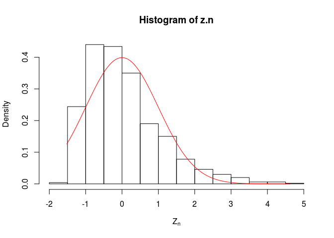
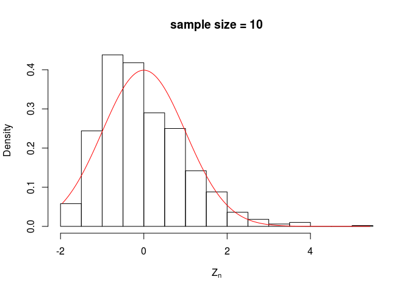
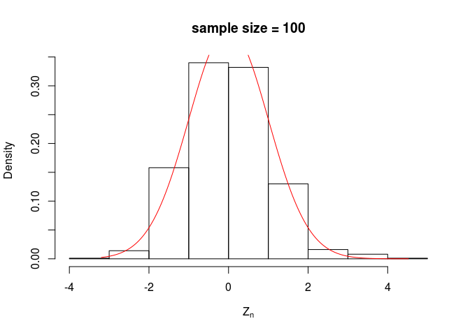
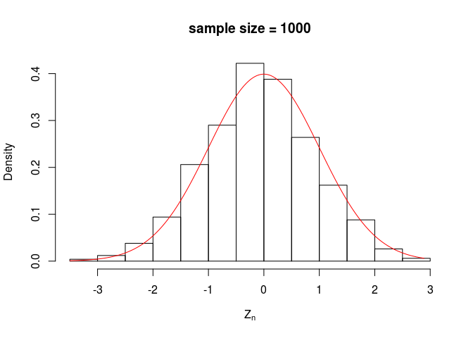

# Seminar 2: Introduction To Simulation

**This seminar was first written by Gloria Li and has been modified by W. Evan Durno**

## Overview

In this seminar we will explore some basic results from probability theory such as the central limit theorem (CLT) and law of large numbers (LLN). This will give us the opportunity to learn how to use R to simulate data and do some basic plotting.

## Before You Start

Make sure you have gone through and understood [R and RStudio Set Up][Rsetup],  [R basics][basicWorkspace], [Feeding data][dataFeed] and [R objects][Robjects] in previous seminars before you start.

The following resources may also be helpful for this seminar.

* [Functions][functions]
* [Probability Functions In R][probability_functions]
* [Flow Control - `if`, `for`, and `while`][flow_control]
* [Apply functions][apply]

## Notation

To simplify the following exposition we will define some notation and terminology.

* Independent identically distributed (IID) random variables are any sequence of $(Y_{i})_{i=1}^{n}$ such that each $Y_{i}$ is sampled from the same distribution independently.

* We will denote the probability density or mass function of random variable $Y$ as $f(y)$.

* The expected value or mean of a random variable $Y$ will be denoted $\mathbb{E}(Y)$, and we will sometimes use $\mu$ to denote $\mathbb{E}(Y)$. Recall for continuous random variables $\mathbb{E}(Y)=\int_{-\infty}^{\infty} y f(y) dy$ and for a discrete random variable $\mathbb{E}(Y)=\sum y f(y)$.

* The variance of a random variable $Y$ will be denoted $\mathbb{V}(Y)$, and we will use $\sigma^{2}$ to denote $\mathbb{V}$. Recall for continuous random variables $\mathbb{V}(Y) = \mathbb{E}(Y - \mu)^2 = \int_{-\infty}^{\infty} (y - \mu)^{2} f(y) dy$ and for a discrete random variable $\mathbb{V}(Y)=\sum (y - \mu)^{2} f(y)$.

## Reproducing Results (Using Random Seed)

In this tutorial when we simulate data in a code block we will first set the random seed to 1. This ensures anyone running the code will get exactly the same output, even though we are drawing *random* numbers. There is nothing special about setting the seed to 1; we could have used another number just as well. See [random seeds][random_seed] for more details.


```r
set.seed(1)
```

## Weak Law Of Large Numbers

There are various Laws Of Large Numbers which essentially provide a guarantee that sample means will get close to the true mean as the sample size gets larger. In classical statistics this result is especially important as it guarantees point estimators will converge to the true parameter of interest.

We will focus on the Weak Law Of Large Numbers (WLLN). The formal statement of the WLLN is as follows: let $Y_{1}, Y_{2}, \ldots, Y_{n}$ be a sequence of IID random variables with $\mathbb{E}(Y_{i})=\mu$. The sample mean, $\overline{Y}_{n}$, is defined as $\overline{Y}_{n}=\frac{1}{n}\sum_{i=1}^{n}Y_{i}$.

The WLLN formally states

$$
  \begin{aligned}
    \overline{Y}_{n} & \overset{P}{\rightarrow} \mu
  \end{aligned}
$$

where $\overset{P}{\rightarrow}$ means converges in probability.

Intuitively this means that if we draw samples of size $n$ a large number of times and compute sample means $\overline{Y}_{n}$, then as $n$ gets bigger the resulting distribution will become more tightly peaked around $\mu$.

### Example

To explore the WLLN, we will work with the Normal distribution $X \sim N(\mu, \sigma^{2})$. R offers a lot of built in functions for statistical distributions, see [Probability Functions In R][probability_functions]. 

In the next code block we will plot the Normal distribution density function for some different parameters, similar to the plot we've seen in lecture 2. 

Before plotting the densities we will create a vector of 1000 values for `x` from -5 to 5 using the `seq` command. We will then evaluate the Normal density function using different parameters at each of these values. This will give us the sets of vectors which will form the $x$ and $y$ components of a 2D line plot.


```r
min.x <- -5

max.x <- 5

num.samples <- 1000

x <- seq(from = min.x, to = max.x, length = num.samples)
```


To avoid plotting multiple sets of axes over each other we will initialize a blank plot with the option `type="n"` in the `plot` function. The code then uses the `lines` function to plot the densities for the Normal distribution with different parameters. This can be done in many ways, but in the next block we will add each density plot one at a time.


```r
# Open new blank plot with x limits from -5 to 5, and y limits from 0 to 1
plot(c(-5, 5), c(0, 1), xlab = 'x', ylab = 'f(x)', main = "Normal probability density function", type = "n")

# Add each density plot one at a time
lines(x, dnorm(x, mean = 0, sd = 0.5), lwd = 2, col = "red")

lines(x, dnorm(x, mean = 0, sd = 1), lwd = 2, col = "green")

lines(x, dnorm(x, mean = 0, sd = 2), lwd = 2, col = "blue")

lines(x, dnorm(x, mean = -2, sd = 1), lwd = 2, col = "magenta")

# We can also add a legend to the plot  
legend("topright", c("mean=0, sd=0.5", "mean=0, sd=1", "mean=0, sd=2", "mean=-2, sd=1"), col = c("red","green","blue","magenta"), lty = 1, lwd = 2)
```

 

> Note the default parameters for Normal distribution in R is the standard Normal. So `dnorm(x, mean=0, sd=1)` is equivalent to `dnorm(x)`. 

A more elegant approach to add the lines is to use a `for` loop to go through and add each density to the plot. We will define some variables to loop over first.


```r
normal.mean <- c(0, 0, 0, -2)

normal.sd <- c(0.5, 1, 2, 1)

colors <- c("red", "green", "blue", "magenta")
```

Now we can use the `for` loop to repeatedly call the `lines` function with different arguments.


```r
# Open new plot with x limits from -5 to 5, and y limits from 0 to 1
plot(c(-5, 5), c(0, 1), xlab = 'x', ylab = 'f(x)', main = "Normal probability density function", type = "n")

# Add density plots with a for loop
for(i in 1:length(normal.mean)){
  lines(x, dnorm(x, mean = normal.mean[i], sd = normal.sd[i]), lwd = 2, col = colors[i])
}

# Add a legend to the plot  
legend("topright", paste0("mean=", normal.mean, ", sd=", normal.sd), col = colors, lty = 1, lwd = 2)
```

 

If you are used to programming in other languages the last code block will seem intuitive. This what is called *procedural programming*, which basically means we define an explicit procedure for the computer to follow step by step. For more information, refer to [Flow Control - `if`, `for`, and `while`][flow_control]. 

For various reasons, speed and readability being the primary ones, the last approach is not the preferred one in R. The next code block shows a more idiomatic way to do the same thing in R using the `mapply` function. This style of programming is called *functional programming*. Essentially the concept is that we have variables and we *apply* a function to those variables, see [apply functions][apply]. 

> Apart from built in functions offered by R packages, we can also create our own functions for easy reuse, see materials from [STAT 545][functions]. 


```r
# Open new plot with x limits from -5 to 5, and y limits from 0 to 1
plot(c(-5, 5), c(0, 1), xlab = 'x', ylab = 'f(x)', main = "Normal probability density function", type = "n")

# Create our own user-defined function for plotting Normal probability density function
f <- function(col, ...){
  lines(x, dnorm(x, ...), col = col, lwd = 2)
}

# apply this function with different parameters
plot.status <- mapply(f, mean = normal.mean, sd = normal.sd, col = colors)

# Add a legend to the plot  
legend("topright", paste0("mean=", normal.mean, ", sd=", normal.sd), col = colors, lty = 1, lwd = 2)
```

 

> In a pinch if you cannot figure out how to use functions like `apply` and `mapply` to solve a problem but the solution is obvious using a `for` loop, use the `for` loop. If the `for` loop is too hard just use the simple solution of having multiple lines. Always get the code working first, and then go back try to make it more *elegant* or idiomatic if it runs slowly or becomes a burden to work with.


### Simulating Data

To explore the WLLN the first thing we need to do is simulate random numbers. The following code draws 5 values from the Nomal distribution with mean = 1 and sd = 1

> Note the first line sets the random seed so your results should match.


```r
set.seed(1)

normal.mean <- 1
normal.sd <- 1

rnorm(n = 5, mean = normal.mean, sd = normal.sd)
```

```
## [1] 0.3735462 1.1836433 0.1643714 2.5952808 1.3295078
```

Now lets try a bigger sample of 1000 and see how it compares to the true distribution. We will compute a [kernel density estimation][kernel] of a random sample taken from the Normal distribution and plot it in blue. We will also plot the true density in red.


```r
# Draw a sample
set.seed(1)

y <- rnorm(n=1000, mean = normal.mean, sd = normal.sd)

# Estimate sample density
estimated.density <- density(y)

# Plot the estimated density
plot(estimated.density, col="blue", lwd = 2)

# Add the data points under the density plot and colors them organge
rug(y, col="orange")

# Plot the true density lines
x <- seq(from = -5, to = 5, length=1000)

true.density <- dnorm(x, mean = normal.mean, sd = normal.sd)

lines(x, true.density, col="red", lwd = 2)

legend("topright", c("sample density", "true density"), col = c("blue", "red"), lty = 1, lwd = 2)
```

 

### Computing Descriptive Statistics

According to the WLLN if we draw a large number of observations and compute the sample mean, this value should be close to the true mean. We can check this by simulating a large sample and then comparing the sample mean to the true mean.

First we will set the random seed, and parameters for the Normal distribution.


```r
set.seed(1)

normal.mean <- 1
normal.sd <- 1
```

So the true mean is equal to what we set for `normal.mean` and we will save it for later use.


```r
(true.mean <- normal.mean)
```

```
## [1] 1
```

> In the last line we surronded the variable assigment by brackets. This is a short way to assign a value to the variable and have R print the variable. It is equivalent to the following code.


```r
true.mean <- normal.mean
print(true.mean)
```

```
## [1] 1
```

We can do the same thing with the true variance.


```r
(true.variance <- normal.sd^2)
```

```
## [1] 1
```

Now we will draw 100 observations from the distribution and compare the sample mean to the true mean.


```r
n <- 100

y <- rnorm(n, mean = normal.mean, sd = normal.sd)

# This is the sample mean
(y.mean <- mean(y))
```

```
## [1] 1.108887
```

```r
# Compare the sample mean to the true mean
y.mean - true.mean
```

```
## [1] 0.1088874
```

> Exercise 1: Try computing the sample mean and variance using the built in functions `mean` and `var`. Compare these to the values you would get by manually implementing the functions

In theory the sample mean should converge to the true mean as we increase the sample size. We can explore this by simulating from a range of sample sizes and plotting the difference between the true mean and sample means.

First we will generate 100 different samples each of size 10. We will store this data in a matrix where each row represents a single sample.


```r
set.seed(1)

# Number of samples
num.samp <- 100

# Size of each sample
samp.size <- 10

# Generate the samples in a matrix with num.samp rows and samp.size columns
y <- matrix(rnorm(n = num.samp * samp.size, mean = normal.mean, sd = normal.sd),
            nrow = num.samp, ncol=samp.size)
```

Now we can compute the mean for each sample. One approach is to use the apply function to take the mean of each row.


```r
y.mean <- apply(y, 1, mean)
```

> Exercise 2: What would the following code do `y.means <- apply(y, 2, mean)`?

We can check we computed the correct number, 100, of sample means by looking at the length of the `y.mean` variable.


```r
length(y.mean)
```

```
## [1] 100
```

We can also look at the first few values of `y.mean` using `head`.


```r
head(y.mean)
```

```
## [1] 0.7531053 1.4308355 1.1723149 1.0056772 0.8410406 1.2483291
```

Taking the mean of the rows is so common there is a built in function called `rowMeans`. This will do the same thing as `apply` but has two benefits. First, it is easier to read the code as the intent is more explicit. Second, the resulting code will run faster because the function is optimized.

> R is an interpreted language, and code written in R can be slow. To side step this issue many built in functions in R are written in C, which is faster but harder to program in. Functions like `rowMeans` pass the entire data matrix into C and the computation is done in C. In contrast using `apply` will pass each row individually into C, which results in more work being done in R, hence the code is slower.

> Do not get bogged down in trying to write fast code, focus on writing readable code. Its far better to write code which is easy to understand but runs a little slower. In the case of `rowMeans` readability and speed are both benefits, so it is an optimal choice.


```r
y.mean <- rowMeans(y)
```

As you can see we get the same result.


```r
length(y.mean)
```

```
## [1] 100
```


```r
head(y.mean)
```

```
## [1] 0.7531053 1.4308355 1.1723149 1.0056772 0.8410406 1.2483291
```

We can now compute the difference between the sample mean and the true mean.


```r
mean.diff <- y.mean - true.mean
```

And we can look at the first few values again


```r
head(mean.diff)
```

```
## [1] -0.246894746  0.430835507  0.172314940  0.005677169 -0.158959383
## [6]  0.248329100
```

We can make a boxplot of the differences.


```r
boxplot(mean.diff)
```

 

To explore the WLLN we need to try a few different sample sizes. At this point it will be beneficial to put the code we just executed into a function for reuse.


```r
normalSampleMean <- function(normal.mean, normal.sd, num.samp, samp.size){
  y <- matrix(rnorm(n = num.samp * samp.size, mean = normal.mean, sd = normal.sd),
              nrow = num.samp, ncol=samp.size)

  y.mean <- rowMeans(y)

  return(y.mean)
}
```

We can now use this function to compute the differences of means across a range of sample sizes. First we will set a range of sample sizes to use from 10 to 10,000. We will also give the entries some human readable names, which will make life easier when we make plots.


```r
samp.sizes <- c(10, 100, 1000, 1e4)

names(samp.sizes) <- paste0("n=", samp.sizes)

samp.sizes
```

```
##    n=10   n=100  n=1000 n=10000 
##      10     100    1000   10000
```

> Note we can use scientific notation to save typing i.e. we could put 1e4 instead of 10,000. For example we could set samp.sizes using `samp.sizes <- c(10, 1e2, 1e3, 1e4)` to save typing some zeros.

Now we can use `sapply` to call the function `normalSampleMean` for different sample sizes.


```r
set.seed(1)

num.samp <- 100

y.mean <- sapply(samp.sizes, normalSampleMean, num.samp = num.samp, normal.mean = normal.mean, normal.sd = normal.sd)
```

Alternatively, if you are not comfortable enough with `sapply` function yet, you can always use a `for` loop to do this. 


```r
set.seed(1)

num.samp <- 100

# Create an empty matrix to store y.means later
y.mean <- matrix(nrow = num.samp, ncol = length(samp.sizes), dimnames = list(c(1:num.samp),names(samp.sizes)))

# Compute y.means
for(i in 1:length(samp.sizes)){
  y.mean[,i] <- normalSampleMean(samp.size = samp.sizes[i], num.samp = num.samp, normal.mean = normal.mean, normal.sd = normal.sd)
}
```


Finally we can make a boxplot of the results. Setting the names for the `sample.sizes` variable is useful as `boxplot` can use these to label to plot.


```r
boxplot(y.mean - true.mean, xlab = "Sample size (n)", ylab = expression(bar(Y)[n]-mu))
```

 

From the boxplot we see two phenomena related to the WLLN. First, the mean of the boxplots gets closer to 0 as we increase the number of samples. This shows the sample mean is converging to the population mean as predicted by the WLLN. Second, the variance (spread) of the boxplots is decreasing as the number of samples increases.

## Central Limit Theorem

One of the most useful results in probability for statisticians is the Central Limit Theorem (CLT). Intuitively the CLT says the sum of any set of independent identically distributed (IID) random variables is approximately normally distributed.

More formally, let $Y_{1}, Y_{2}, \ldots, Y_{n}$ be a sequence of IID random variables with $\mathbb{E}(Y_{i})=\mu$ and $\mathbb{V}(Y_{i})=\sigma^{2}$ and define $\overline{Y}_{n}=\frac{1}{n}\sum_{i=1}^{n}Y_{i}$. The CLT states that

$$
  \begin{aligned}
    Z_{n} & = \frac{\overline{Y}_{n} - \mu}{\sqrt{\mathbb{V}(\overline{Y})}} \\
          & = \frac{\sqrt{n}(\overline{Y}_{n} - \mu)}{\sigma} \\
          & \overset{d}{\rightarrow} Z
  \end{aligned}
$$

where $\overset{d}{\rightarrow}$ means converges in distribution and

$$
  \begin{aligned}
    Z & \sim N(0, 1)
  \end{aligned}
$$

That is

$$
  \begin{aligned}
    \lim_{n\rightarrow\infty} \mathbb{P}(Z_{n} \le z) & = \mathbf{\Phi}(z) \\
                                                      & = \int_{-\infty}^{z} \frac{1}{2 \pi} e ^{x^{2}/2} dx
  \end{aligned}
$$

The most surprising thing about the CLT is that it only assumes $Y_{i}$ have finite mean and variance. This is what makes the CLT such a generally useful result.

> There are some common distributions which don't satisfy the conditions of the CLT. The most famous is the Cauchy distribution which does not have a finite mean or variance.

### Example

To show that CLT holds true even when the original distribution is not normal, we will work with a [Chi-square distribution][chisq] with its degrees of freedom df=1. This distribution looks like this:


```r
df <- 1

x <- seq(0, 10, length=1000)

plot(x, dchisq(x, df = df), type="l", xlab='x', ylab='f(x)', main="Chi-square probability density function")
```

 

The first thing we will do is to figure out how to simulate variables. This step is very similar to our simulation on Normal distribution above, only instead of `rnorm` we use `rchisq` here.  


```r
set.seed(1)

# set sample size and the number of samples to draw
samp.size <- 5

num.samp <- 1000

# Draw 1000 samples and compute means
y <- matrix(rchisq(n = num.samp * samp.size, df = df), nrow = num.samp, ncol=samp.size)

y.mean <- rowMeans(y)
```

Next, we will compute $Z_{n}$ with the true mean and variance given below. 


```r
# Compute the true values
true.mean <- df

true.variance <- df*2

# Compute normalised values
z.n <- (sqrt(samp.size) * (y.mean - true.mean)) / sqrt(true.variance)

# Plot a histogram
hist(z.n, probability=TRUE, xlab=expression(Z[n]))

# Compute the normal density and overlay it on the plot in red
y <- seq(min(z.n), max(z.n), length=1000)

dens <- dnorm(y, mean=0, sd=1)

lines(y, dens, col="red")
```

 

Our simulated data looks a bit skewed and doesn't fit the standard Normal curve so well. This is because we are using a low value of 5 for $n$, called `samp.size` in the code. The CLT only holds asymptotically, so that we need larger values of $n$ before the distribution will start to look normally distributed.

Before we try larger values of $n$ it will be useful to extract the code for computing $Z_{n}$ into a function.


```r
chisqNormalisedMean <- function(df, num.samp, samp.size){
  # Compute the true values
  true.mean <- df

  true.variance <- df*2

  # Draw samples 
  y <- matrix(rchisq(n = num.samp * samp.size, df = df), nrow = num.samp, ncol=samp.size)

  y.mean <- rowMeans(y)

  # Compute normalised values
  z.n <- (sqrt(samp.size) * (y.mean - true.mean)) / sqrt(true.variance)

  return(z.n)
}
```

To save more typing we will also put the plotting code into a function.


```r
plotNormalComparison <- function(df, num.samp, n){
  z.n <- chisqNormalisedMean(df, num.samp, n)

  # It will be nice to have a title
  fig.title <- paste0("sample size = ", n)

  # Plot a histogram
  hist(z.n, probability=TRUE, main=fig.title, xlab=expression(Z[n]))

  # Compute the normal density and overlay it on the plot in red
  y <- seq(min(z.n), max(z.n), length=1000)

  dens <- dnorm(y, mean=0, sd=1)

  lines(y, dens, col="red")
}
```

Now we can try some different values of $n$ using `lapply` function and see how things look.


```r
set.seed(1)

samp.sizes <- c(5, 10, 100, 1000)

plot.status <- lapply(samp.sizes, plotNormalComparison, num.samp = num.samp, df = df)
```

    

As you can see the distribution of $Z_{n}$ looks more and more like the standard Normal distribution when we increase $n$.

We can formally check this idea using the [Kolmogorov-Smirnov (KS) test][ks_test]. Informally, the KS test compares a random sample to a theoretical distribution to see how similar they are.

The function `ks.test` allows us to perform the KS test. The function requires two arguments, `x` and `y`. The first argument , `x`, is a vector of random samples. The second argument, `y`, can be either another vector of random samples, a string indicating the cumulative distribution function, or an actual cumulative distribution function. Since we want to check whether our samples are normally distributed we will pass in the `pnorm` function which is the cumulative normal function. We will also pass in some additional arguments `mean` and `sd` which `ks.test` ignores and instead pass to the `pnorm` function.

By default the `ks.test` function checks the null hypothesis the two distributions are equal. Thus low p-values for the test would indicate the distributions are different.

Let's try a simple example with $n=5$.


```r
set.seed(1)

n <- 5

z.n <- chisqNormalisedMean(df, num.samp, n)

ks.test(z.n, pnorm, mean=0, sd=1)
```

```
## 
## 	One-sample Kolmogorov-Smirnov test
## 
## data:  z.n
## D = 0.0719, p-value = 6.463e-05
## alternative hypothesis: two-sided
```

Based on the p-value we would reject the hypothesis that $Z_{n}$ is sampled from the standard normal distribution at any reasonable significance level. On the other hand if we try the same thing with $n=1000$ we will see that we cannot reject the null hypothesis $Z_{n}$ comes from a standard normal.


```r
set.seed(1)

n <- 1000

z.n <- chisqNormalisedMean(df, num.samp, n)

ks.test(z.n, pnorm, mean=0, sd=1)
```

```
## 
## 	One-sample Kolmogorov-Smirnov test
## 
## data:  z.n
## D = 0.0264, p-value = 0.4895
## alternative hypothesis: two-sided
```


## Take-home problem

This problem is inpsired by problem 2.20 from "All Of Statistics" by
Wasserman which Jenny mentioned in lecture 2. You don't have to do
every last suggestion here. Just start and see how it goes.

The goal will be to simulate flipping a coin $n$ times, where the coin
comes up heads with probability $p$. As the value of $n$ gets large
the relative frequency of flips which are heads (that is, the fraction
of tosses which are heads) should tend to $p$.

Pick the probability $p$. Pick a sample size $n$. Simulate the $n$
coin flips experiment and count the number of heads. Convert that to a
proportion.

Now do the same for many values of $n$. Plot those proportions against
$n$. Add the true $p$ for reference if you can. What do you see? Is it
what you expected?

For kicks, you could draw several samples for each value of $n$. If
you do that, then you can compute means, variances, MAD, IQR, etc. of
the observed proportions for various sample sizes. You could plot them
in various ways.

Consider a different value of $p$. Or a different number of samples
taken for each sample size. How painful is it to change your code? How
would you do things differently next time?

> Hints :
> * In lecture 2 you'll see some code for simulating coin flips with
> `runif()`. There are ways to use `rbinom()` as well.

## Exercise Solutions

Below are some solutions to the small exercises in this seminar.

### Exercise 1
First we will generate the sampled values.


```r
n <- 100

normal.mean <- 1

normal.sd <- 1

y <- rnorm(n, mean = normal.mean, sd = normal.sd)
```

Now we can compute the mean and variances both ways.


```r
# Mean using built in function
mean(y)
```

```
## [1] 0.9536113
```


```r
# Mean computed manually
sum(y) / length(y)
```

```
## [1] 0.9536113
```


```r
# Sample variance computed using built in function
var(y)
```

```
## [1] 0.8964573
```


```r
# Sample variance computed manually
sum((y - mean(y))^2) / (length(y) - 1)
```

```
## [1] 0.8964573
```

### Exercise 2

The code `y.means <- apply(y, 2, mean)` will take the mean of the columns instead of the rows. The second argument of `apply` indicates which dimension to *apply* the function over. For a matrix 1 indicates the rows while 2 indicates the columns.


<!-- Jenny adding this as a suggested exercise for them to tackle  -->
<!-- on their own. Here's a solution; you'll have to write a couple -->
<!-- sentences posing the challenge. -->

<!--
## inspired by Wasserman problem 2.20
## coin comes up heads w/ prob p
## toss it n times and count rel freq of heads
## show this tends p as n grows

p <- 0.35
nN <- 5
n <- floor(10^seq(from = 0, to = 4, length = 100))
foo <- lapply(n, function(thisN) rbinom(n = nN, size = thisN, p = p)/thisN)
hDat <- data.frame(n = rep(n, each = nN),
                   obsRelFreq = unlist(foo))

xyplot(obsRelFreq ~ n, hDat,
       scales = list(x = list(log = 10)),
       xlab = "Number of coin tosses",
       ylab = "Obs rel freq of heads",
       panel = function(x, y, ...) {
         panel.abline(h = p)
         panel.xyplot(x, y, ...)
         })
-->

[Rsetup]: https://stat545-ubc.github.io/block000_r-rstudio-install.html
[basicWorkspace]: https://stat545-ubc.github.io/block002_hello-r-workspace-wd-project.html
[dataFeed]: https://stat545-ubc.github.io/block006_care-feeding-data.html
[Robjects]: https://stat545-ubc.github.io/block004_basic-r-objects.html 

[functions]: http://www.statmethods.net/management/userfunctions.html
[random_seed]: http://en.wikibooks.org/wiki/R_Programming/Random_Number_Generation
[probability_functions]: http://www.statmethods.net/advgraphs/probability.html
[flow_control]: http://www.statmethods.net/management/controlstructures.html
[apply]: http://nsaunders.wordpress.com/2010/08/20/a-brief-introduction-to-apply-in-r/

[kernel]: http://en.wikipedia.org/wiki/Kernel_density_estimation
[chisq]: http://en.wikipedia.org/wiki/Chi-squared_distribution
[ks_test]: http://en.wikipedia.org/wiki/Kolmogorov%E2%80%93Smirnov_test
