STAT 540 - Seminar 2b: Graphing using ggplot2
=============================================

Learning Objectives
-------------------

By the end of this seminar, you should

-   have an overall understanding of what ggplot2 is and have a sense of what is it useful for, and what are its limitations
-   be familiar with ggplot2’s layered grammar - for example, know the roles of aes, geom, stat, scale, etc
-   given a dataset, be able to render basic plots such as scatter plots, line graphs, density plots, and histograms
-   have practical experience exploring ggplot2 functions by tweaking rendered visualizations (mappings, colours, shapes, transformations, etc)
-   be able to navigate [the ggplot2 cheatsheet](https://www.rstudio.com/wp-content/uploads/2015/03/ggplot2-cheatsheet.pdf) in order to develop a data visualization

Packages required
-----------------

-   [tidyverse](http://tidyverse.tidyverse.org/) (includes [ggplot2](http://ggplot2.tidyverse.org/), [dplyr](http://dplyr.tidyverse.org/), [tidyr](http://tidyr.tidyverse.org/), [readr](http://readr.tidyverse.org/), [purrr](http://purrr.tidyverse.org/), [tibble](http://tibble.tidyverse.org/))
    -   Install by running 'install.packages("tidyverse", dependencies = TRUE)'

Functions used
--------------

-   **%&gt;%** - Syntactic sugar for easily piping the result of one function into another.
-   **ggplot2::ggplot()** - Base function for using ggplot2. Lays out the invisible 'canvas' for graphing.
-   **ggplot2::geom\_point()** - Geom function for drawing data points in scatterplots.
-   **ggplot2::geom\_smooth()** - Geom function for drawing fitted lines in trend charts.
-   **ggplot2::geom\_bar()** - Geom function for drawing bars in bar graphs.
-   **ggplot2::geom\_density()** - Geom function for drawing density plots.
-   **ggplot2::geom\_boxplot()** - Geom function for drawing box plots.
-   **ggplot2::geom\_violin()** - Geom function for violin plots.
-   **ggplot2::facet\_wrap()** - ggplot2 function for separating factor levels into multiple graphs.
-   **ggplot2::xlab()** - Manually set x-axis label.
-   **ggplot2::ylab()** - Manually set y-axis label.
-   **ggplot2::scale\_y\_reverse()** - Reverse y-axis.
-   **ggplot2::coord\_flip()** - Flip x and y axes.
-   **ggplot2::coord\_polar()** - Use polar axes.
-   **dplyr::group\_by()** - Commonly used with summarize() to derive summarized values for multiple rows sharing certain attribues, e.g. Average fuel consumption rates of different car manufacturer.
-   **dplyr::summarize()** - Commonly used with summarize() to derive summarized values for multiple rows sharing certain attribues.

Part 1: First time ggplot-ing (contains excerpts from [Ch. 3 of R for Data Science](http://r4ds.had.co.nz/data-visualisation.html))
-----------------------------------------------------------------------------------------------------------------------------------

Open a new .Rmd file. This is where we will work on ggplot2.

“The simple graph has brought more information to the data analyst’s mind than any other device.” — John Tukey

This chapter will teach you how to visualise your data using ggplot2. R has several systems for making graphs, but ggplot2 is one of the most elegant and most versatile. ggplot2 implements the grammar of graphics, a coherent system for describing and building graphs. With ggplot2, you can do more faster by learning one system and applying it in many places.

First, we load tidyverse, which includes ggplot2.

``` r
library(tidyverse)
```

    ## ── Attaching packages ────────────────────────────────── tidyverse 1.2.1 ──

    ## ✔ ggplot2 2.2.1     ✔ purrr   0.2.4
    ## ✔ tibble  1.4.2     ✔ dplyr   0.7.4
    ## ✔ tidyr   0.8.0     ✔ stringr 1.3.0
    ## ✔ readr   1.1.1     ✔ forcats 0.3.0

    ## ── Conflicts ───────────────────────────────────── tidyverse_conflicts() ──
    ## ✖ dplyr::filter() masks stats::filter()
    ## ✖ dplyr::lag()    masks stats::lag()

That one line of code loads the core tidyverse; packages which you will use in almost every data analysis. It also tells you which functions from the tidyverse conflict with functions in base R (or from other packages you might have loaded).

If you run this code and get the error message “there is no package called ‘tidyverse’”, you’ll need to first install it, then run library() once again.

    install.packages("tidyverse", dependencies = TRUE)
    library(tidyverse)

You only need to install a package once, but you need to reload it every time you start a new session.

If we need to be explicit about where a function (or dataset) comes from, we’ll use the special form package::function(). For example, ggplot2::ggplot() tells you explicitly that we’re using the ggplot() function from the ggplot2 package.

### The mpg data frame

Let’s use our first graph to answer a question: Do cars with big engines use more fuel than cars with small engines? You probably already have an answer, but try to make your answer precise. What does the relationship between engine size and fuel efficiency look like? Is it positive? Negative? Linear? Nonlinear?

You can test your answer with the mpg data frame found in ggplot2 (aka ggplot2::mpg). A data frame is a rectangular collection of variables (in the columns) and observations (in the rows). mpg contains observations collected by the US Environment Protection Agency on 38 models of car.

Let's see what the mpg data frame looks like:

``` r
mpg
```

    ## # A tibble: 234 x 11
    ##    manufacturer model    displ  year   cyl trans   drv     cty   hwy fl   
    ##    <chr>        <chr>    <dbl> <int> <int> <chr>   <chr> <int> <int> <chr>
    ##  1 audi         a4        1.80  1999     4 auto(l… f        18    29 p    
    ##  2 audi         a4        1.80  1999     4 manual… f        21    29 p    
    ##  3 audi         a4        2.00  2008     4 manual… f        20    31 p    
    ##  4 audi         a4        2.00  2008     4 auto(a… f        21    30 p    
    ##  5 audi         a4        2.80  1999     6 auto(l… f        16    26 p    
    ##  6 audi         a4        2.80  1999     6 manual… f        18    26 p    
    ##  7 audi         a4        3.10  2008     6 auto(a… f        18    27 p    
    ##  8 audi         a4 quat…  1.80  1999     4 manual… 4        18    26 p    
    ##  9 audi         a4 quat…  1.80  1999     4 auto(l… 4        16    25 p    
    ## 10 audi         a4 quat…  2.00  2008     4 manual… 4        20    28 p    
    ## # ... with 224 more rows, and 1 more variable: class <chr>

Among the variables in mpg are:

displ, a car’s engine size, in litres.

hwy, a car’s fuel efficiency on the highway, in miles per gallon (mpg). A car with a low fuel efficiency consumes more fuel than a car with a high fuel efficiency when they travel the same distance.

To learn more about mpg, open its help page by running ?mpg.

### Creating a ggplot

To plot mpg, run this code to put displ on the x-axis and hwy on the y-axis:

``` r
ggplot(data = mpg) + 
  geom_point(mapping = aes(x = displ, y = hwy))
```


The plot shows a negative relationship between engine size (displ) and fuel efficiency (hwy). In other words, cars with big engines use more fuel. Does this confirm or refute your hypothesis about fuel efficiency and engine size?

With ggplot2, you begin a plot with the function ggplot(). ggplot() creates a coordinate system that you can add layers to. The first argument of ggplot() is the dataset to use in the graph. So ggplot(data = mpg) creates an empty graph, but it’s not very interesting so I’m not going to show it here.

You complete your graph by adding one or more layers to ggplot(). The function geom\_point() adds a layer of points to your plot, which creates a scatterplot. ggplot2 comes with many geom functions that each add a different type of layer to a plot. You’ll learn a whole bunch of them throughout this chapter.

Each geom function in ggplot2 takes a mapping argument. This defines how variables in your dataset are mapped to visual properties. The mapping argument is always paired with aes(), and the x and y arguments of aes() specify which variables to map to the x and y axes. ggplot2 looks for the mapped variable in the data argument, in this case, mpg.

### Your first (bare-bones) graphing template

Let’s turn this code into a reusable template for making graphs with ggplot2. To make a graph, replace the bracketed sections in the code below with a dataset, a geom function, or a collection of mappings.

    ggplot(data = <DATA>) + 
      <GEOM_FUNCTION>(mapping = aes(<MAPPINGS>))
      

Have fun with this! Take 5 minutes to explore what you can do with the mpg dataset and this template. See [here](http://ggplot2.tidyverse.org/reference/) for a list of all '<GEOM_FUNCTIONS>' and '<MAPPINGS>'. Look at the Layer:geoms and Aesthetics sections. We used 'geom\_point' and 'x' and 'y' mappings for the scatterplot above.

### Aesthetic mappings

In the plot below, one group of points (highlighted in red) seems to fall outside of the linear trend. These cars have a higher mileage than you might expect. How can you explain these cars?

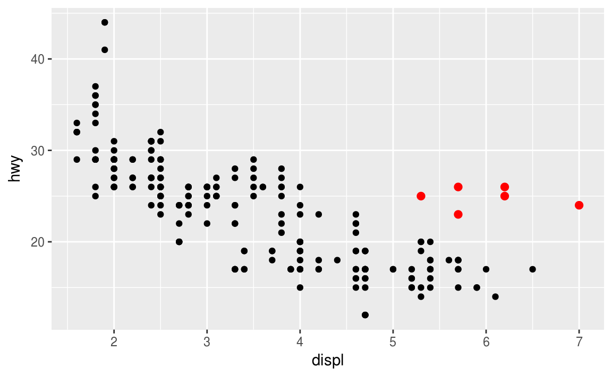

Let’s hypothesize that the cars are hybrids. One way to test this hypothesis is to look at the class value for each car. The class variable of the mpg dataset classifies cars into groups such as compact, midsize, and SUV. If the outlying points are hybrids, they should be classified as compact cars or, perhaps, subcompact cars (keep in mind that this data was collected before hybrid trucks and SUVs became popular).

You can add a third variable, like class, to a two dimensional scatterplot by mapping it to an aesthetic. An aesthetic is a visual property of the objects in your plot. Aesthetics include things like the size, the shape, or the color of your points. You can display a point (like the one below) in different ways by changing the values of its aesthetic properties. Since we already use the word “value” to describe data, let’s use the word “level” to describe aesthetic properties. Here we change the levels of a point’s size, shape, and color to make the point small, triangular, or blue:

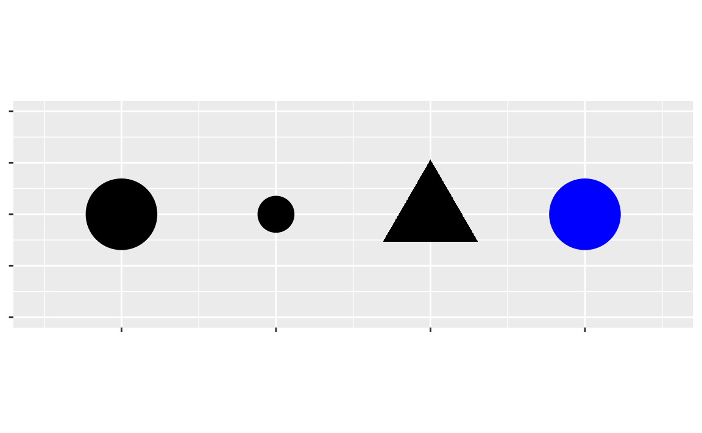

You can convey information about your data by mapping the aesthetics in your plot to the variables in your dataset. For example, you can map the colors of your points to the class variable to reveal the class of each car.

``` r
ggplot(data = mpg) + 
  geom_point(mapping = aes(x = displ, y = hwy, color = class))
```

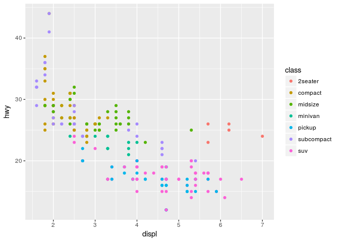

(If you prefer British English, like Hadley, you can use colour instead of color.)

To map an aesthetic to a variable, associate the name of the aesthetic to the name of the variable inside aes(). ggplot2 will automatically assign a unique level of the aesthetic (here a unique color) to each unique value of the variable, a process known as scaling. ggplot2 will also add a legend that explains which levels correspond to which values.

The colors reveal that many of the unusual points are two-seater cars. These cars don’t seem like hybrids, and are, in fact, sports cars! Sports cars have large engines like SUVs and pickup trucks, but small bodies like midsize and compact cars, which improves their gas mileage. In hindsight, these cars were unlikely to be hybrids since they have large engines.

In the above example, we mapped class to the color aesthetic, but we could have mapped class to the size aesthetic in the same way. In this case, the exact size of each point would reveal its class affiliation. We get a warning here, because mapping an unordered variable (class) to an ordered aesthetic (size) is not a good idea.

``` r
ggplot(data = mpg) + 
  geom_point(mapping = aes(x = displ, y = hwy, size = class))
```

    ## Warning: Using size for a discrete variable is not advised.

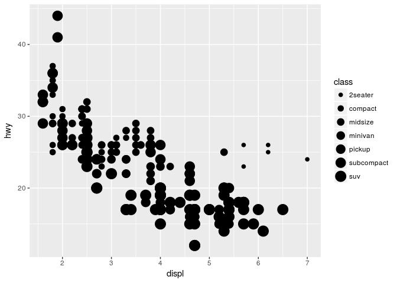

For each aesthetic, you use aes() to associate the name of the aesthetic with a variable to display. The aes() function gathers together each of the aesthetic mappings used by a layer and passes them to the layer’s mapping argument. The syntax highlights a useful insight about x and y: the x and y locations of a point are themselves aesthetics, visual properties that you can map to variables to display information about the data.

Once you map an aesthetic, ggplot2 takes care of the rest. It selects a reasonable scale to use with the aesthetic, and it constructs a legend that explains the mapping between levels and values. For x and y aesthetics, ggplot2 does not create a legend, but it creates an axis line with tick marks and a label. The axis line acts as a legend; it explains the mapping between locations and values.

You can also set the aesthetic properties of your geom manually. For example, we can make all of the points in our plot blue:

``` r
ggplot(data = mpg) + 
  geom_point(mapping = aes(x = displ, y = hwy), color = "blue")
```

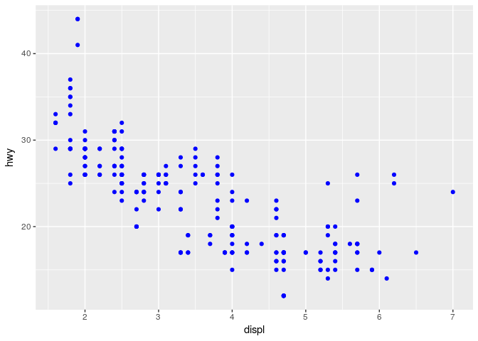

Here, the color doesn’t convey information about a variable, but only changes the appearance of the plot. To set an aesthetic manually, set the aesthetic by name as an argument of your geom function; i.e. it goes outside of aes().

**IMPORTANT** - Take note of what goes inside or outside of aes() and what the corresponding effects are. Putting colour outside aes() and expecting the colors to map to some variable is a common rookie mistake.

Part 2: The layered grammar
---------------------------

Now you've seen some data visualizations made using ggplot2. Pretty neat, right?

But at this point, you might be very confused by the syntax, especially if you have seen some base R or lattice graphing functions. Other graphing systems often have specific function calls for specific types of graphs and takes a variety of inputs in order to tweak the corresponding details.

In contrast, the power of ggplot2 lies in its layered grammar. Notice that the call to "ggplot2()" by itself doesn't produce a graph. It simply lays out a invisible canvas for subsequent "geoms" to be added to. In this way, new things are "layered" on top of each other to produce the final visualization.

Read more [here](http://vita.had.co.nz/papers/layered-grammar.pdf), if you’d like to learn more about the theoretical underpinnings of ggplot2.

### Basic concepts

**Layer**: The most important concept of ggplot2 is that graphics are built from different layers. This includes anything from the data used, the coordinate system, the axis labels, the plot’s title etc. This layered grammar is perhaps the most powerful feature of ggplot2. It allows one to build complex graphics by adding more and more layers to the basic graphics while each layer is simple enough to construct. Layers can contain one or more components such as data and aesthetic mapping, geometries, statistics, scaling etc. We will talk about some most common components next.

**Aesthetics**: They are graphic elements mapped to data defined by aes(). Some of the common aesthetics we usually define are: x-y positions, color, size, shape, linetype etc. Beginners are usually easily confused between aesthetics and geometries. An easy way to distinguish is that you are always trying to assign (map) data to some graphic elements in aesthetics, while in geometries you don’t feed in any information on the data. It will become clear with some examples later

**Geometries**: These are the actual graphic elements used to plot, like points / lines / bars etc. These functions usually start with geom\_ and their names are usually self-explanatory. You can also specify color and other graphic elements in these functions, but it will be a single value that’s applied to the entire data. Here is a simple way to see what geometries functions are available:

``` r
apropos("^geom_")
```

    ##  [1] "geom_abline"     "geom_area"       "geom_bar"       
    ##  [4] "geom_bin2d"      "geom_blank"      "geom_boxplot"   
    ##  [7] "geom_col"        "geom_contour"    "geom_count"     
    ## [10] "geom_crossbar"   "geom_curve"      "geom_density"   
    ## [13] "geom_density2d"  "geom_density_2d" "geom_dotplot"   
    ## [16] "geom_errorbar"   "geom_errorbarh"  "geom_freqpoly"  
    ## [19] "geom_hex"        "geom_histogram"  "geom_hline"     
    ## [22] "geom_jitter"     "geom_label"      "geom_line"      
    ## [25] "geom_linerange"  "geom_map"        "geom_path"      
    ## [28] "geom_point"      "geom_pointrange" "geom_polygon"   
    ## [31] "geom_qq"         "geom_quantile"   "geom_raster"    
    ## [34] "geom_rect"       "geom_ribbon"     "geom_rug"       
    ## [37] "geom_segment"    "geom_smooth"     "geom_spoke"     
    ## [40] "geom_step"       "geom_text"       "geom_tile"      
    ## [43] "geom_violin"     "geom_vline"

**Statistics**: These provide a simple and powerful way to summarize your data and present calculated statistics on the plot, like adding a regression line, a smoothed curve, calculating density curves etc. For a full list, see below. You can see some of the functions look very similar to some geom functions. Indeed these two categories are not mutually exclusive. Some geom functions implemented statistical calculation and stat functions also come with default geometries.

``` r
apropos("^stat_")
```

    ##  [1] "stat_bin"         "stat_bin2d"       "stat_bin_2d"     
    ##  [4] "stat_binhex"      "stat_bin_hex"     "stat_boxplot"    
    ##  [7] "stat_contour"     "stat_count"       "stat_density"    
    ## [10] "stat_density2d"   "stat_density_2d"  "stat_ecdf"       
    ## [13] "stat_ellipse"     "stat_function"    "stat_identity"   
    ## [16] "stat_qq"          "stat_quantile"    "stat_smooth"     
    ## [19] "stat_spoke"       "stat_sum"         "stat_summary"    
    ## [22] "stat_summary2d"   "stat_summary_2d"  "stat_summary_bin"
    ## [25] "stat_summary_hex" "stat_unique"      "stat_ydensity"

**Scale**: Another powerful feature to alter the default scale to x-y axes, e.g. do a log transformation, instead of the traditional 2-step approach of transforming the data first and then plot it. You can also do more advanced customization to features like color, fill, etc. with these functions. Functions available are

``` r
apropos("^scale_")
```

    ##  [1] "scale_alpha"               "scale_alpha_continuous"   
    ##  [3] "scale_alpha_discrete"      "scale_alpha_identity"     
    ##  [5] "scale_alpha_manual"        "scale_color_brewer"       
    ##  [7] "scale_color_continuous"    "scale_color_discrete"     
    ##  [9] "scale_color_distiller"     "scale_color_gradient"     
    ## [11] "scale_color_gradient2"     "scale_color_gradientn"    
    ## [13] "scale_color_grey"          "scale_color_hue"          
    ## [15] "scale_color_identity"      "scale_color_manual"       
    ## [17] "scale_colour_brewer"       "scale_colour_continuous"  
    ## [19] "scale_colour_date"         "scale_colour_datetime"    
    ## [21] "scale_colour_discrete"     "scale_colour_distiller"   
    ## [23] "scale_colour_gradient"     "scale_colour_gradient2"   
    ## [25] "scale_colour_gradientn"    "scale_colour_grey"        
    ## [27] "scale_colour_hue"          "scale_colour_identity"    
    ## [29] "scale_colour_manual"       "scale_fill_brewer"        
    ## [31] "scale_fill_continuous"     "scale_fill_date"          
    ## [33] "scale_fill_datetime"       "scale_fill_discrete"      
    ## [35] "scale_fill_distiller"      "scale_fill_gradient"      
    ## [37] "scale_fill_gradient2"      "scale_fill_gradientn"     
    ## [39] "scale_fill_grey"           "scale_fill_hue"           
    ## [41] "scale_fill_identity"       "scale_fill_manual"        
    ## [43] "scale_linetype"            "scale_linetype_continuous"
    ## [45] "scale_linetype_discrete"   "scale_linetype_identity"  
    ## [47] "scale_linetype_manual"     "scale_radius"             
    ## [49] "scale_shape"               "scale_shape_continuous"   
    ## [51] "scale_shape_discrete"      "scale_shape_identity"     
    ## [53] "scale_shape_manual"        "scale_size"               
    ## [55] "scale_size_area"           "scale_size_continuous"    
    ## [57] "scale_size_date"           "scale_size_datetime"      
    ## [59] "scale_size_discrete"       "scale_size_identity"      
    ## [61] "scale_size_manual"         "scale_x_continuous"       
    ## [63] "scale_x_date"              "scale_x_datetime"         
    ## [65] "scale_x_discrete"          "scale_x_log10"            
    ## [67] "scale_x_reverse"           "scale_x_sqrt"             
    ## [69] "scale_x_time"              "scale_y_continuous"       
    ## [71] "scale_y_date"              "scale_y_datetime"         
    ## [73] "scale_y_discrete"          "scale_y_log10"            
    ## [75] "scale_y_reverse"           "scale_y_sqrt"             
    ## [77] "scale_y_time"

### New template

    ggplot(data = <DATA>) + 
      <GEOM_FUNCTION>(
         mapping = aes(<MAPPINGS>),
         stat = <STAT>, 
         position = <POSITION>
      ) +
      <COORDINATE_FUNCTION> +
      <SCALE_FUNCTION> +
      <AXIS_FUNCTION> +
      <FACET_FUNCTION>

Note that this template doesn't include every possible use case. But it does a pretty good job illustrating the structure of a typical ggplot call. Notice how things are "layered up"?

### How to use this template?

So far, you've seen the basic scatterplot with using geom\_point() and aes() functionalities. Now, we will showcase a sample of the other functionalities so you have an idea of how to build more elaborate visualizations with the given template.

#### Smooth line

Let's add a smooth line (regression with loess) to our previous scatterplot of engine size against fuel efficiency.

``` r
ggplot(data = mpg, 
       mapping = aes(x = displ, y = hwy)) +
  geom_point() +
  geom_smooth()
```

    ## `geom_smooth()` using method = 'loess'

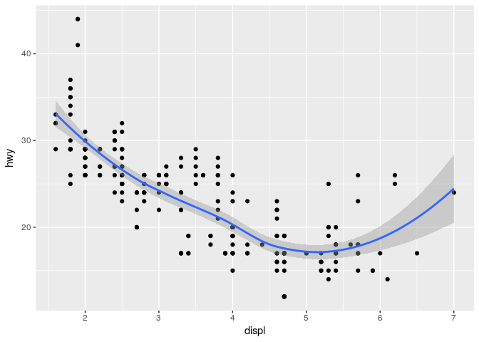

Notice that mapping = aes() has been moved to the ggplot() call. This ensures that this argument is passed to all subsequent layers: geom\_point() and geom\_smooth() in this case. If you move the aes() argument in both layers separately, the result would be exactly the same. Try it.

#### Continuous variable as the third dimension

Lets color the data points by year.

``` r
ggplot(data = mpg, 
       mapping = aes(x = displ, y = hwy, color = year)) +
  geom_point() +
  geom_smooth()
```

    ## `geom_smooth()` using method = 'loess'

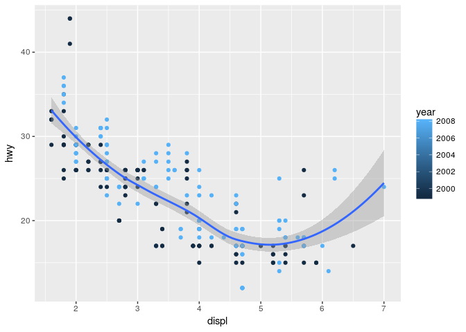

Notice that ggplot makes a color gradient for showing the continuous variable year. Try a different variable. Try something discrete? Like trans?

#### Bar chart

Now let's see what we can do with geom\_bar().

Lets try and plot a bar graph to show the difference in average fuel efficiency among the different vehicle types.

In case you haven't seen the summarize() function before - it is one of the most handy functions in the dplyr package. Used with group\_by(), you can easily find out summary values like mean, median, min, and max for certain variables for different groups. Very soon, you will have another seminar that introduces the dplyr package more formally. Bear with me for now!

Also, this symbol: **%&gt;%** is called a "pipe". It is a syntactic sugar that simply takes the object on its left and feed it into the function call on its right. This way, you can "pipe" an input through sequence of function calls nicely, without having to deal with the cumbersome syntax. The output of the previous function call can very easily be fed into the next function call as its input.

For example, this:

    foo0(input)

becomes this:

    input %>% foo0()

and this:

    foo2(foo1(foo0(input)))

becomes this:

    input %>% foo0() %>% foo1() %>% foo2()

To read more about pipes click [here](http://r4ds.had.co.nz/pipes.html).

Now that we got that out of the way, let's make our bar graph.

First we find the average fuel efficiency for each class.

``` r
(averageEfficiency <- 
  mpg %>% group_by(class) %>% summarise(fuel_efficiency = mean(hwy)))
```

    ## # A tibble: 7 x 2
    ##   class      fuel_efficiency
    ##   <chr>                <dbl>
    ## 1 2seater               24.8
    ## 2 compact               28.3
    ## 3 midsize               27.3
    ## 4 minivan               22.4
    ## 5 pickup                16.9
    ## 6 subcompact            28.1
    ## 7 suv                   18.1

averageEfficiency is a new data set with summarized averages for fuel efficency for each type of vehicles.

Let's plot it using a bar graph for easy comparison. Try it yourself first before peeking! See how far you can get.

``` r
ggplot(averageEfficiency) + 
  geom_bar(aes(x = class, y = fuel_efficiency))
## Error: stat_count() must not be used with a y aesthetic.
```

Oh, no! What went wrong?

Turns out geom\_bar() uses "stat = count" by default. In other words, it would count up the number of rows for a given x value and display that. That basically shows the distribution of some discrete x variable. In which case, the supplied y mapping is irrelevant and hence the error.

But we want geom\_bar() to plot bars with heights specified by our y mapping. So what do we do? We can use "stat = identity", which asks geom\_bar() to take variable values in the supplied y mapping that correspond to the x values.

``` r
ggplot(averageEfficiency) + 
  geom_bar(aes(x = class, y = fuel_efficiency),
           stat = "identity")
```


Here we go! Looks like pickup trucks and SUVs are the worse in terms of fuel efficiency (meaning they have per gallon distance). Makes sense?

Let's add some color to our bar chart, sam way we added color mapping to the scatterplot.

``` r
ggplot(averageEfficiency) + 
  geom_bar(aes(x = class, y = fuel_efficiency, fill = class),
           stat = "identity")
```

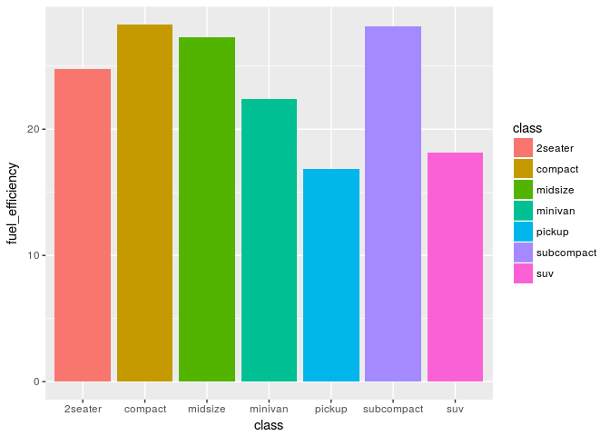

What a pretty rainbow! Not exactly a helpful data visualizaton tip, but just so you know you can do it :).

#### <AXIS_LABEL_FUNCTION>

The axis labels are pretty ugly right now. Let's put in nicer look labels.

``` r
ggplot(averageEfficiency) + 
  geom_bar(aes(x = class, y = fuel_efficiency, fill = class),
           stat = "identity") +
  ylab("Fuel Efficiency (miles per gallon)") +
  xlab("Vehicle Type")
```

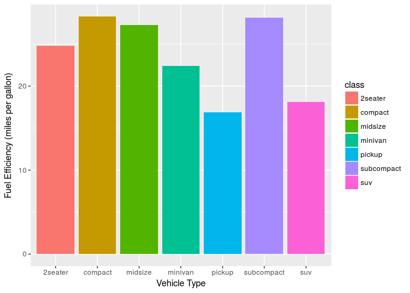

#### <SCALE_FUNCTION>

Let's reverse the y-scale... just for fun :D.

``` r
ggplot(averageEfficiency) + 
  geom_bar(aes(x = class, y = fuel_efficiency, fill = class),
           stat = "identity") +
  ylab("Fuel Efficiency (miles per gallon)") +
  xlab("Vehicle Type") +
  scale_y_reverse()
```

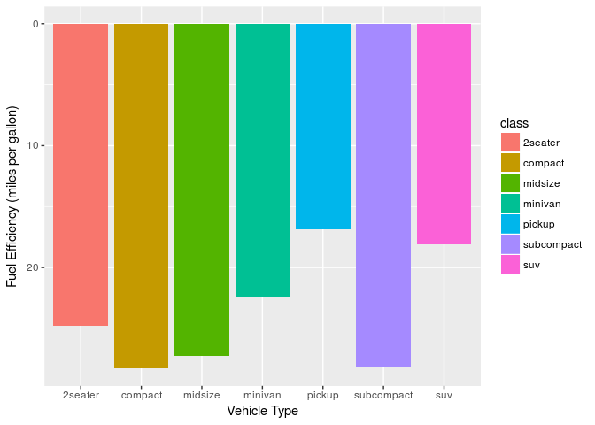

#### <COORDINATE_FUNCTION>

Let's add another "layer" to alter our coordinate system. By default, coord\_cartesian() is used for geom\_point() and geom\_bar(). Let's try and explore a few others.

coord\_flip?

``` r
ggplot(averageEfficiency) + 
  geom_bar(aes(x = class, y = fuel_efficiency, fill = class),
           stat = "identity") +
  coord_flip()
```

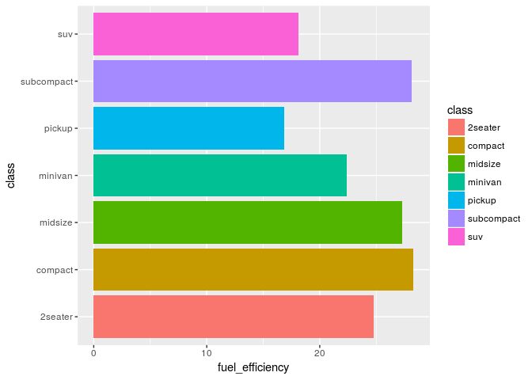

coord\_polar?

``` r
ggplot(averageEfficiency) + 
  geom_bar(aes(x = class, y = fuel_efficiency, fill = class),
           stat = "identity") +
  coord_polar()
```

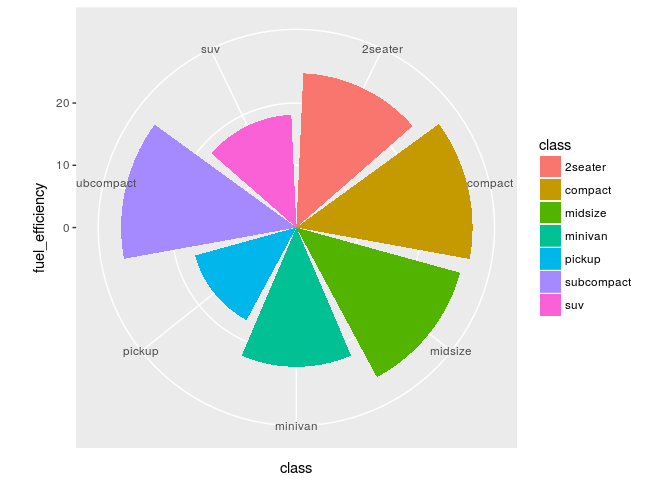

Isn't that cool or what.

#### <FACET_FUNCTION>

One thing in the template that we haven't talked about is the FACET\_FUNCTION.

This is a pretty special function that allows you to render multiple graphs at once, one for each class of a variable.

To illustrate this functionality, lets go back to the scatterplot.

``` r
ggplot(data = mpg, 
       mapping = aes(x = displ, y = hwy)) +
  geom_point()
```

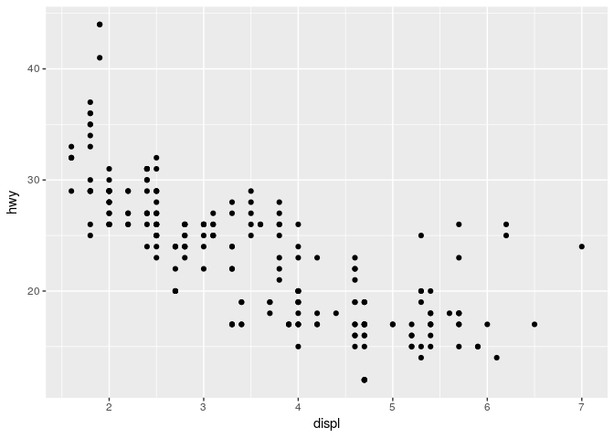

Now, you suspect that vehicle type (class) may complicate this relationship between engine size and fuel efficiency. So let's use facet\_wrap() to split the vehicle types into different plots.

``` r
ggplot(data = mpg, 
       mapping = aes(x = displ, y = hwy)) +
  geom_point() +
  facet_wrap(~class)
```

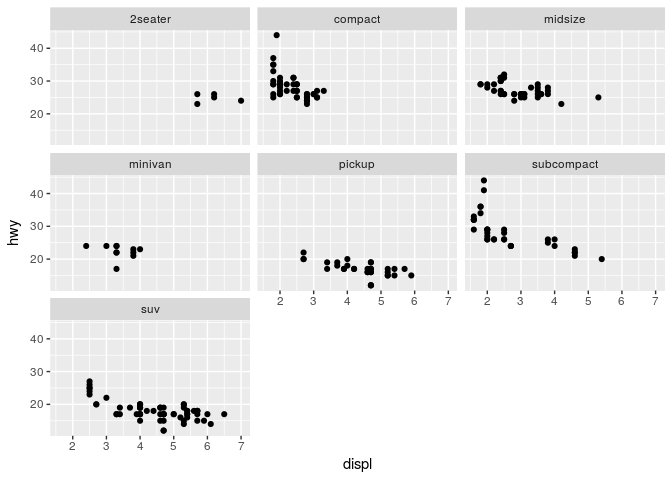

There is also a facet\_grid() function that we will not go into in this seminar. Feel free to read more [here](http://r4ds.had.co.nz/data-visualisation.html#facets).

Part 3: Deliverable
-------------------

-   **Challenge**: Reproduce the visual below using the mpg dataset. Show it to a TA to be checked off for completion.

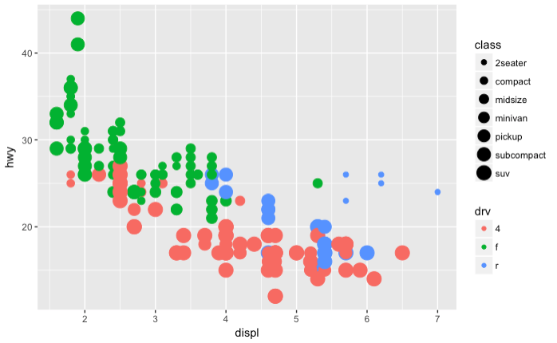

Part 4: Data visualization demos (for your reference)
-----------------------------------------------------

Skip this part if you are running out of time. You can always come back later!

Here we present the code for a variety of commonly used data visualizations in gene expression analyses. You probably won't have enough time to try out everything. Please do skim through them so you have an idea of what ggplot2 is capable of. We also hope that, in the future, you can come back here for some inspiration when developing very cool visualizations!

First, load the [data](https://github.com/STAT540-UBC/STAT540-UBC.github.io/blob/master/seminars/seminars_winter_2017/seminar2b/GSE4051_MINI.rds). Ignore the details of how the data is imported. That is not important for now.

But, take note of the what the data frame looks like.

``` r
kDat <- readRDS("GSE4051_MINI.rds")
oDat <-
  with(kDat,
       data.frame(sidChar, sidNum, devStage, gType,
                  probeset = factor(rep(c("crabHammer", "eggBomb",
                                          "poisonFang"), each = nrow(kDat))),
                  geneExp = c(crabHammer, eggBomb, poisonFang)))
oDat %>% head() # only printing the first 6 rows
```

    ##     sidChar sidNum devStage gType   probeset geneExp
    ## 1 Sample_20     20      E16    wt crabHammer  10.220
    ## 2 Sample_21     21      E16    wt crabHammer  10.020
    ## 3 Sample_22     22      E16    wt crabHammer   9.642
    ## 4 Sample_23     23      E16    wt crabHammer   9.652
    ## 5 Sample_16     16      E16 NrlKO crabHammer   8.583
    ## 6 Sample_17     17      E16 NrlKO crabHammer  10.140

### Gene expression scatterplots

Gene expression changes over the course of development.

``` r
ggplot(oDat, aes(devStage, geneExp)) + 
   geom_point()
```


Different genes in separate panels.

``` r
ggplot(oDat, aes(devStage, geneExp)) + 
   geom_point() +
  facet_wrap(~ probeset)
```

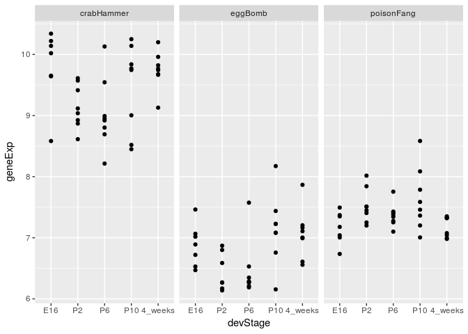

Add genotype information.

``` r
ggplot(oDat, aes(devStage, geneExp)) + 
   geom_point() +
  facet_wrap(~ probeset) +
  aes(color = gType)
```

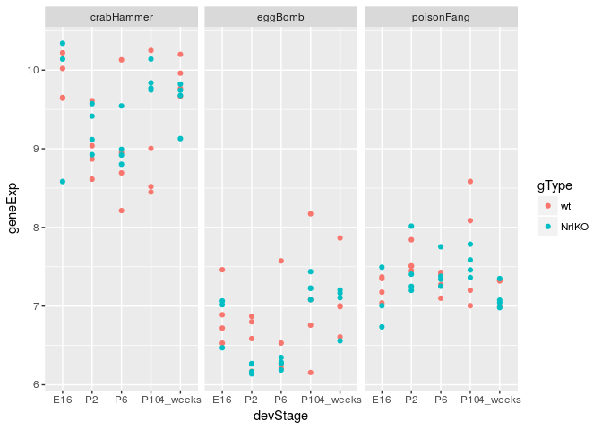

### Density plots

``` r
ggplot(oDat, aes(geneExp)) + 
   geom_density()
```

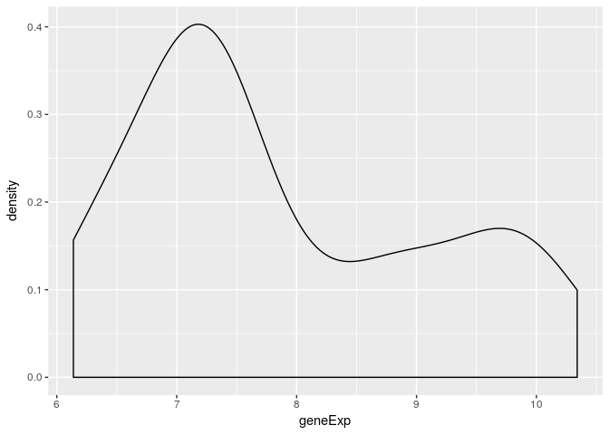

Ddding data points at the bottom.

``` r
ggplot(oDat, aes(geneExp)) + 
   geom_density() +
  geom_point(aes(y = 0.05), position = position_jitter(height = 0.005))
```

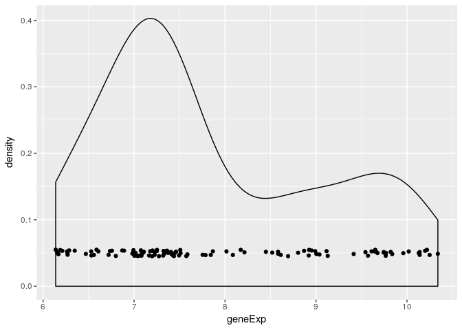

Separate panels for different genotype.

``` r
ggplot(oDat, aes(geneExp)) + 
  geom_density() +
  geom_point(aes(y = 0.05), position = position_jitter(height = 0.005)) +
  facet_wrap(~ gType)
```


Or different colors for different genotype.

``` r
ggplot(oDat, aes(geneExp, color = gType)) + 
  geom_density() +
  geom_point(aes(y = 0.05), position = position_jitter(height = 0.005))
```


### Boxplot

``` r
ggplot(oDat, aes(devStage, geneExp)) + 
   geom_boxplot()
```

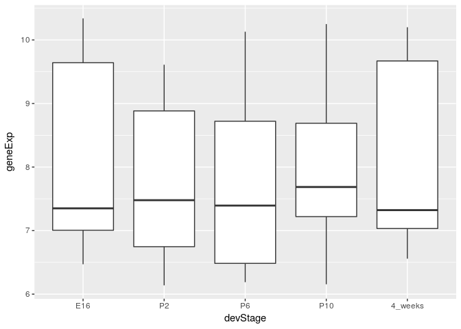

Separate two genotypes.

``` r
ggplot(oDat, aes(devStage, geneExp)) + 
   geom_boxplot() +
  facet_wrap(~ gType)
```

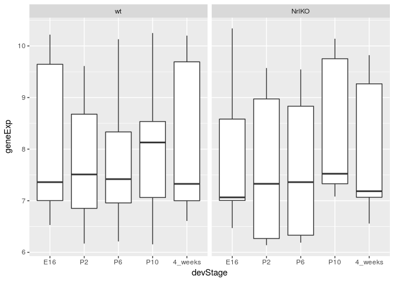

A violinplot is a hybrid of densityplot and histogram.

``` r
ggplot(oDat, aes(devStage, geneExp)) + 
   geom_violin()
```

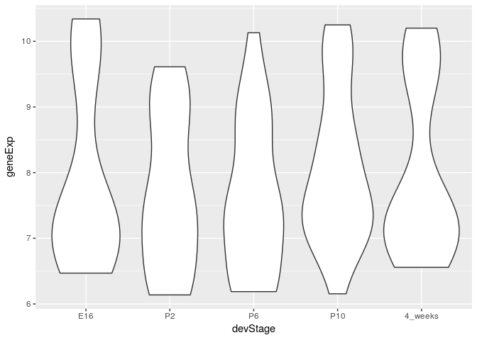

Final notes and additional resources
------------------------------------

**We have not covered all possible visualizations**. The purpose of this seminar was to introduce ggplot2 and to give you the tools to develop other visualizations that may come your way in the future. Arguably, the most important takeway of this seminar is the layered grammar of ggplot2. Once you understand the core structure of the ggplot2 setup, it will be easy to navigate and use the package's numerous elements in order to produce any desired outcome.

Here are a few more resources for your reference:

-   [ggplot2, part of the tidyverse](http://ggplot2.tidyverse.org/index.html)
-   [the ggplot2 cheat sheet](https://www.rstudio.com/wp-content/uploads/2015/03/ggplot2-cheatsheet.pdf)
-   [The Layered Grammar of Graphics](http://vita.had.co.nz/papers/layered-grammar.pdf)
-   [R for Data Science](http://r4ds.had.co.nz/data-visualisation.html) by Garrett Grolemund and Hadley Wickham
-   [ggplot2-tutorial by Dr. Jenny Bryan](https://github.com/jennybc/ggplot2-tutorial)

Attributions
------------

This seminar was developed by [Eric Chu](https://github.com/echu113) with seminar [materials](https://stat540-ubc.github.io/seminars/sm03b_ggplot2.html) previously designed by Gloria Li and Alice Zh and [R for Data Science](http://r4ds.had.co.nz/data-visualisation.html) by Garrett Grolemund and Hadley Wickham.
