Seminar 6: Dimensionality reduction and Cluster Analysis
========================================================

Contributors: Gabriela Cohen Freue, Jasleen Grewal, Alice Zhu.

Learning objectives
-------------------

By the end of this tutorial, you should be able to
- Differentiate between sample-wise clustering and gene-wise clustering, and identify when either is used.
- Differentiate between agglomerative hierarchical clustering and partition clustering methods like K-means.
- Outline the methods used to determine an optimal number of clusters in K-means clustering.
- Undertake dimensionality reduction using PCA.
- Appreciate the differences between PCA and t-SNE.
- Recognize that the t-SNE approach is an intricate process requiring parametrization.
- Add cluster annotations to t-SNE visualizations of their datasets.
- Understand the limitations of the clustering methods, PCA, and t-SNE, as discussed in this seminar.

Introduction
------------

In this seminar we'll explore clustering genes and samples using the Affymetrix microarray data on characterizing the gene expression profile of nebulin knockout mice. This data was made available by Li F et al., with the GEO accession number [GSE70213](https://www.ncbi.nlm.nih.gov/sites/GDSbrowser?acc=GDS5881). There are two genotypes - the wildtype mice, and the knockout mice. We will compare the results of different clustering algorithms on the data, evaluate the effect of filtering/feature selection on the clusters, and lastly, try to assess if different attributes help explain the clusters we see.

Load data and packages
----------------------

**Install required libraries**
Install required packages if you haven't done so before. This seminar will require `GEOquery`, `pvclust`, `xtable`, `limma`, `cluster`, `RColorBrewer`, and `plyr`.

> Remember you may need to edit the file paths below, to reflect your working directory and local file storage choices.

``` r
library(RColorBrewer)
library(cluster)
library(pvclust)
```

    ## Warning: package 'pvclust' was built under R version 3.3.3

``` r
library(xtable)
library(limma)
```

    ## Warning: package 'limma' was built under R version 3.3.3

``` r
library(plyr)
library(lattice)
library(RCurl)
```

    ## Warning: package 'RCurl' was built under R version 3.3.3

``` r
options(download.file.method = "curl")
library(GEOquery)
library(knitr)
library(pheatmap)
```

    ## Warning: package 'pheatmap' was built under R version 3.3.3

If you don't have `GEOquery` installed, you will need to get it using biocLite (`install.packages` won't work!).

``` r
source("http://bioconductor.org/biocLite.R")
biocLite("GEOquery")
```

**Read the data into R**
&gt; We will be reading in the data using the GEOquery library. This lets us read in the expression data and phenotypic data for a particular analysis, using its GEO accession ID.

``` r
if (file.exists("GSE70213.Rdata")) {
    # if previously downloaded
    load("GSE70213.Rdata")
} else {
    # Get geo object that contains our data and phenotype information
    geo_obj <- getGEO("GSE70213", GSEMatrix = TRUE)
    geo_obj <- geo_obj[[1]]
    save(geo_obj, file = "GSE70213.Rdata")
}
# Get expression data
data <- exprs(geo_obj)

# Get covariate data
prDes <- pData(geo_obj)[, c("organism_ch1", "title", colnames(pData(geo_obj))[grep("characteristics", 
    colnames(pData(geo_obj)))])]

## Clean up covariate data
colnames(prDes) = c("organism", "sample_name", "tissue", "genotype", "sex", "age")
prDes$tissue = as.factor(gsub("tissue: ", "", prDes$tissue))
prDes$genotype = as.factor(gsub("genotype: ", "", prDes$genotype))
prDes$sex = as.factor(gsub("Sex: ", "", prDes$sex))
prDes$age = gsub("age: ", "", prDes$age)
```

> You might get an error like `Error in download.file..cannot download all files`.
> This happens when R cannot connect to the NCBI ftp servers from linux systems. We will need to set the 'curl' option to fix this.

``` r
options(download.file.method = "curl")
```

### Exploratory analysis

Let us take a look at our data.

``` r
kable(head(data[, 1:5]))
```

|          |   GSM1720833|   GSM1720834|   GSM1720835|   GSM1720836|   GSM1720837|
|----------|------------:|------------:|------------:|------------:|------------:|
| 10338001 |  2041.408000|  2200.861000|  2323.760000|  3216.263000|  2362.775000|
| 10338002 |    63.780590|    65.084380|    58.308200|    75.861450|    66.956050|
| 10338003 |   635.390400|   687.393600|   756.004000|  1181.929000|   759.099800|
| 10338004 |   251.566800|   316.997300|   320.513200|   592.806000|   359.152500|
| 10338005 |     2.808835|     2.966376|     2.985357|     3.352954|     3.155735|
| 10338006 |     3.573085|     3.816430|     3.815323|     4.690040|     3.862684|

``` r
dim(data)
```

    ## [1] 35557    24

We have 24 samples (*columns*) and 35,557 genes (*rows*) in our dataset. If we look in our covars object (called prDes), we should have 24 rows, each corresponding to each sample.

``` r
kable(head(prDes))
```

|            | organism     | sample\_name   | tissue     | genotype | sex  | age         |
|------------|:-------------|:---------------|:-----------|:---------|:-----|:------------|
| GSM1720833 | Mus musculus | quad-control-1 | quadriceps | control  | male | 41 days old |
| GSM1720834 | Mus musculus | quad-control-2 | quadriceps | control  | male | 41 days old |
| GSM1720835 | Mus musculus | quad-control-3 | quadriceps | control  | male | 41 days old |
| GSM1720836 | Mus musculus | quad-control-4 | quadriceps | control  | male | 41 days old |
| GSM1720837 | Mus musculus | quad-control-5 | quadriceps | control  | male | 42 days old |
| GSM1720838 | Mus musculus | quad-control-6 | quadriceps | control  | male | 40 days old |

``` r
dim(prDes)
```

    ## [1] 24  6

Now let us see how the gene values are spread across our dataset, with a frequency histogram.

``` r
hist(data, col = "gray", main = "GSE70213 - Histogram")
```

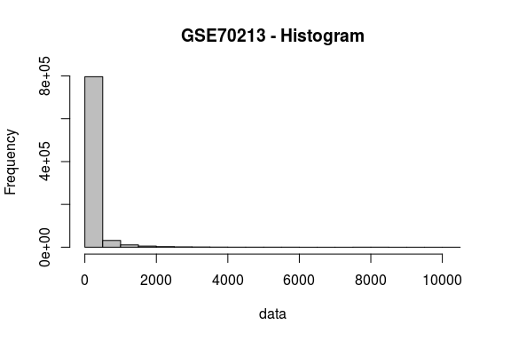

It appears a lot of genes have values &lt; 1000. What happens if we plot the frequency distribution after Log2 transformation?

> Why might it be useful to log transform the data, prior to making any comparisons?

``` r
hist(log2(data + 1), col = "gray", main = "GSE70213 log transformed - Histogram")
```

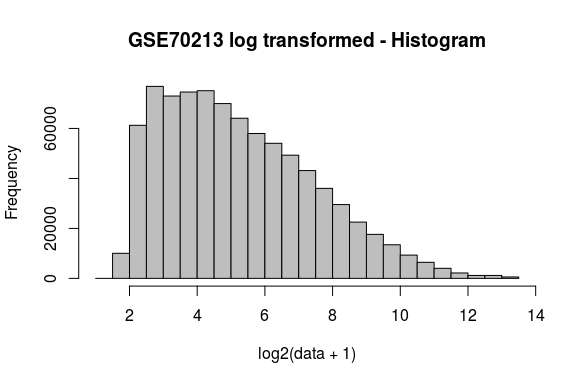

Finally, as an additional step to make visualization easier later, we'll rescale the rows in our data object, since we're not interested in absolute differences in expression between genes at the moment. Note that although one can do this step within the `pheatmap()` function, it will not be available for other functions we will use. We can always go back to the original data if we need to.

``` r
sprDat <- t(scale(t(data)))
str(sprDat, max.level = 0, give.attr = FALSE)
```

    ##  num [1:35557, 1:24] -0.2042 0.9693 -0.0693 -0.3329 -0.7671 ...

``` r
round(data.frame(avgBefore = rowMeans(head(data)), avgAfter = rowMeans(head(sprDat)), 
    varBefore = apply(head(data), 1, var), varAfter = apply(head(sprDat), 1, var)), 
    2)
```

    ##          avgBefore avgAfter varBefore varAfter
    ## 10338001   2109.42        0 110944.28        1
    ## 10338002     55.62        0     70.82        1
    ## 10338003    645.76        0  22386.92        1
    ## 10338004    280.43        0   7513.48        1
    ## 10338005      2.92        0      0.02        1
    ## 10338006      3.64        0      0.07        1

The data for each row -- which is for one probeset -- now has mean 0 and variance 1.

Now, let us try and consider how the various samples cluster across all our genes. We will then try and do some feature selection, and see the effect it has on the clustering of the samples. We will use the covars object to annotate our clusters and identify interesting clusters. The second part of our analysis will focus on clustering the genes across all our samples.

Sample Clustering
-----------------

In this part, we will use samples as objects to be clustered using gene attributes (i.e., vector variables of dimension ~35K).
First we will cluster the data using agglomerative hierarchical clustering. Here, the partitions can be visualized using a **dendrogram** at various levels of granularity. We do not need to input the number of clusters, in this appraoch.
Then, we will find various clustering solutions using partitional clustering methods, specifically K-means and partition around medoids (PAM). Here, the partitions are independent of each other, and the number of clusters is given as an input.
As part of your take-home exercise, you will pick a specific number of clusters, and compare the sample memberships in these clusters across the various clustering methods.

### Hierarchical clustering for mice knockout data

In this section we will illustrate different hierarchical clustering methods. These plots were included in Lecture 16.

However, for most expression data applications, we suggest you should standardize the data; use Euclidean as the "distance" (so it's just like Pearson correlation) and use "average linkage".

``` r
data_to_plot = sprDat
# compute pairwise distances
pr.dis <- dist(t(data_to_plot), method = "euclidean")

# create a new factor representing the interaction of tissue type and genotype
prDes$grp <- with(prDes, interaction(tissue, genotype))
summary(prDes$grp)
```

    ##    quadriceps.control        soleus.control quadriceps.nebulin KO 
    ##                     6                     6                     6 
    ##     soleus.nebulin KO 
    ##                     6

``` r
# compute hierarchical clustering using different linkage types
pr.hc.s <- hclust(pr.dis, method = "single")
pr.hc.c <- hclust(pr.dis, method = "complete")
pr.hc.a <- hclust(pr.dis, method = "average")
pr.hc.w <- hclust(pr.dis, method = "ward.D")

# plot them
op <- par(mar = c(0, 4, 4, 2), mfrow = c(2, 2))

plot(pr.hc.s, labels = FALSE, main = "Single", xlab = "")
plot(pr.hc.c, labels = FALSE, main = "Complete", xlab = "")
plot(pr.hc.a, labels = FALSE, main = "Average", xlab = "")
plot(pr.hc.w, labels = FALSE, main = "Ward", xlab = "")
```

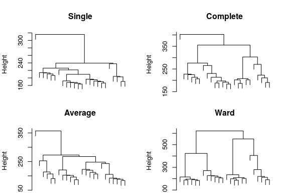

``` r
par(op)
```

We can look at the trees that are output from different clustering algorithms. However, it can also be visually helpful to identify what sorts of trends in the data are associated with these clusters. We can look at this output using heatmaps. We will be using the *pheatmap* package for the same.

When you call `pheatmap()`, it automatically performs hierarchical clustering for you and it reorders the rows and/or columns of the data accordingly. Both the reordering and the dendrograms can be suppressed it with `cluster_rows = FALSE` and/or `cluster_cols = FALSE`.

> Note that when you have a lot of genes, the tree is pretty ugly. Thus, the row clustering was suppressed for now.

By default, `pheatmap()` uses the `hclust()` function, which takes a distance matrix, calculated by the `dist()` function (with `default = 'euclidean'`). However, you can also write your own clustering and distance functions. In the examples below, I used `hclust()` with `ward` linkage method and the `euclidean` distance.

> Note that the dendrogram in the top margin of the heatmap is the same as that of the `hclust()` function.

**Exercise**: Play with the options of the pheatmap function and compare the different heatmaps. Note that one can also use the original data `data` and set the option `scale = "row"`. You will get the same heatmaps although the columns may be ordered differently (use `cluster_cols = FALSE` to suppress reordering).

``` r
# set pheatmap clustering parameters
clust_dist_col = "euclidean"  #‘'correlation'’ for Pearson correlation, ‘'euclidean'’, ‘'maximum'’, ‘'manhattan'’, ‘'canberra'’, ‘'binary'’ or ‘'minkowski'’
clust_method = "ward.D2"  #‘'ward.D'’, ‘'ward.D2'’,‘'single'’, ‘'complete'’, ‘'average'’ (= UPGMA), ‘'mcquitty'’ (= WPGMA), ‘'median'’ (= WPGMC) or ‘'centroid'’ (= UPGMC)
clust_scale = "none"  #'column', 'none', 'row'

## the annotation option uses the covariate object (prDes) we defined. It should
## have the same rownames, as the colnames in our data object (data_to_plot).

pheatmap(data_to_plot, cluster_rows = FALSE, scale = clust_scale, clustering_method = clust_method, 
    clustering_distance_cols = clust_dist_col, , show_colnames = T, show_rownames = FALSE, 
    main = "Clustering heatmap for GSE70213", annotation = prDes[, c("tissue", "genotype", 
        "grp")])
```

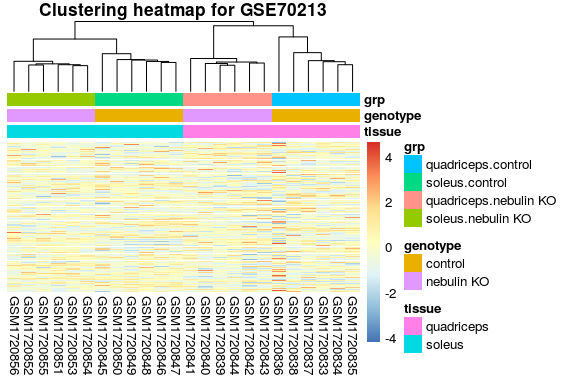

We can also change the colours of the different covariates. As you see, this can help differentiate important variables and the clustering trends.

``` r
## We can change the colours of the covariates
var1 = c("orange1", "darkred")
names(var1) = levels(prDes$tissue)
var2 = c("grey", "black")
names(var2) = levels(prDes$genotype)
var3 = c("pink1", "pink3", "lightblue1", "blue3")
names(var3) = levels(as.factor(prDes$grp))
covar_color = list(tissue = var1, genotype = var2, grp = var3)

my_heatmap_obj = pheatmap(data_to_plot, cluster_rows = FALSE, scale = clust_scale, 
    clustering_method = clust_method, clustering_distance_cols = clust_dist_col, 
    show_rownames = FALSE, main = "Clustering heatmap for GSE70213", annotation = prDes[, 
        c("tissue", "genotype", "grp")], annotation_colors = covar_color)
```

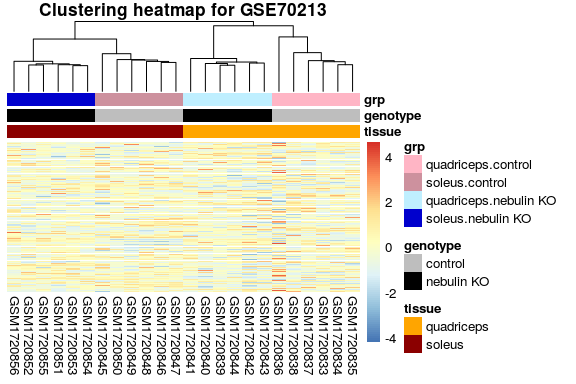

We can also get clusters from our pheatmap object. We will use the `cutree` function to extract the clusters. Note that we can do this for samples (look at the `tree_col`) or for genes (look at the `tree_row`).

``` r
cluster_samples = cutree(my_heatmap_obj$tree_col, k = 10)
# cluster_genes = cutree(my_heatmap_obj$tree_row, k=100)
kable(cluster_samples)
```

|            |    x|
|------------|----:|
| GSM1720833 |    1|
| GSM1720834 |    1|
| GSM1720835 |    1|
| GSM1720836 |    2|
| GSM1720837 |    1|
| GSM1720838 |    3|
| GSM1720839 |    4|
| GSM1720840 |    4|
| GSM1720841 |    5|
| GSM1720842 |    4|
| GSM1720843 |    4|
| GSM1720844 |    4|
| GSM1720845 |    6|
| GSM1720846 |    7|
| GSM1720847 |    7|
| GSM1720848 |    7|
| GSM1720849 |    8|
| GSM1720850 |    9|
| GSM1720851 |   10|
| GSM1720852 |   10|
| GSM1720853 |   10|
| GSM1720854 |   10|
| GSM1720855 |   10|
| GSM1720856 |   10|

Note you can do this with the base `hclust` method too, as shown here. We are using one of the hclust objects we defined earlier in this document.

``` r
# identify 10 clusters
op <- par(mar = c(1, 4, 4, 1))
plot(pr.hc.w, labels = prDes$grp, cex = 0.6, main = "Ward showing 10 clusters")
rect.hclust(pr.hc.w, k = 10)
```

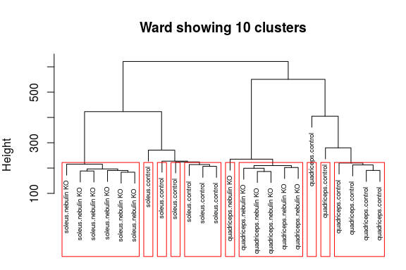

``` r
par(op)
```

We can save the heatmap we made, to a PDF file for reference. Remember to define the filename properly as the file will be saved relative to where you are running the script in your directory structure.

``` r
# Save the heatmap to a PDF file
pdf("GSE70213_Heatmap.pdf")
pheatmap(data_to_plot, cluster_rows = F, scale = clust_scale, clustering_method = clust_method, 
    clustering_distance_cols = clust_dist_col, annotation = prDes[, c("tissue", "genotype", 
        "grp")], annotation_colors = covar_color)
dev.off()
```

### Partitioning methods for mice knockout data

We can build clusters bottom-up from our data, via agglomerative hierarchical clustering. This method produces a dendorgram. As a different algorithmic approach, we can pre-determine the number of clusters (k), iteratively pick different 'cluster representatives', called centroids, and assign the closest remaining samples to it, until the solution converges to stable clusters. This way, we can find the best way to divide the data into the k clusters in this top-down clustering approach.

The centroids can be determined by different means, as covered in lecture already. We will be covering two approaches, *k-means* (implemented in kmeans function), and *k-medoids* (implemented in the pam function).

> Note that the results depend on the initial values (randomly generated) to create the first k clusters. In order to get the same results, you need to set many initial points (see the parameter `nstart`).

#### K-means clustering

Keep in mind that k-means makes certain assumptions about the data that may not always hold:
- Variance of distribution of each variable (in our case, genes) is spherical
- All variables have the same variance
- A prior probability that all k clusters have the same number of members

Often, we have to try different 'k' values before we identify the most suitable k-means decomposition. We can look at the mutual information loss as clusters increase in count, to determine the number of clusters to use.

Here we'll just do a k-means clustering of samples using all genes (~35K).

``` r
# Objects in columns
set.seed(31)
k <- 5
pr.km <- kmeans(t(data_to_plot), centers = k, nstart = 50)

# We can look at the within sum of squares of each cluster
pr.km$withinss
```

    ## [1] 131484.25  95226.22 107233.61 103083.34      0.00

``` r
# We can look at the composition of each cluster
pr.kmTable <- data.frame(exptStage = prDes$grp, cluster = pr.km$cluster)
prTable <- xtable(with(pr.kmTable, table(exptStage, cluster)), caption = "Number of samples from each experimental group within each k-means cluster")
```

``` r
align(prTable) <- "lccccc"
print(prTable, type = "html", caption.placement = "top")
```

<!-- html table generated in R 3.3.2 by xtable 1.8-2 package -->
<!-- Wed Feb 14 12:00:50 2018 -->
<table border="1">
<caption align="top">
Number of samples from each experimental group within each k-means cluster
</caption>
<tr>
<th>
</th>
<th>
1
</th>
<th>
2
</th>
<th>
3
</th>
<th>
4
</th>
<th>
5
</th>
</tr>
<tr>
<td>
quadriceps.control
</td>
<td align="center">
0
</td>
<td align="center">
0
</td>
<td align="center">
0
</td>
<td align="center">
5
</td>
<td align="center">
1
</td>
</tr>
<tr>
<td>
soleus.control
</td>
<td align="center">
6
</td>
<td align="center">
0
</td>
<td align="center">
0
</td>
<td align="center">
0
</td>
<td align="center">
0
</td>
</tr>
<tr>
<td>
quadriceps.nebulin KO
</td>
<td align="center">
0
</td>
<td align="center">
0
</td>
<td align="center">
6
</td>
<td align="center">
0
</td>
<td align="center">
0
</td>
</tr>
<tr>
<td>
soleus.nebulin KO
</td>
<td align="center">
0
</td>
<td align="center">
6
</td>
<td align="center">
0
</td>
<td align="center">
0
</td>
<td align="center">
0
</td>
</tr>
</table>
> Repeat the analysis using a different seed and check if you get the same clusters.

Helpful info and tips:

-   An aside on `set.seed()`: Normally you might not need to set this; R will pick one. But if you are doing a "real" experiment and using methods that require random number generation, you should consider it when finalizing an analysis. The reason is that your results might come out slightly different each time you run it. To ensure that you can exactly reproduce the results later, you should set the seed (and record what you set it to). Of course if your results are highly sensitive to the choice of seed, that indicates a problem. In the case above, we're just choosing genes for an exercise so it doesn't matter, but setting the seed makes sure all students are looking at the same genes.

#### PAM algorithm

In K-medoids clustering, K representative objects (= medoids) are chosen as cluster centers and objects are assigned to the center (= medoid = cluster) with which they have minimum dissimilarity (Kaufman and Rousseeuw, 1990).
Nice features of partitioning around medoids (PAM) are: (a) it accepts a dissimilarity matrix (use `diss = TRUE`).
(b) it is more robust to outliers as the centroids of the clusters are data objects, unlike k-means.

We will determine the optimal number of clusters in this experiment, by looking at the average silhouette value. This is a stastistic introduced in the PAM algorithm, which lets us identify a suitable k.

``` r
pr.pam <- pam(pr.dis, k = k)
pr.pamTable <- data.frame(exptStage = prDes$grp, cluster = pr.pam$clustering)
pamTable <- xtable(with(pr.pamTable, table(exptStage, cluster)), caption = "Number of samples from each experimental group within each PAM cluster")
```

``` r
align(pamTable) <- "lccccc"
print(pamTable, type = "html", caption.placement = "top")
```

<!-- html table generated in R 3.3.2 by xtable 1.8-2 package -->
<!-- Wed Feb 14 12:00:50 2018 -->
<table border="1">
<caption align="top">
Number of samples from each experimental group within each PAM cluster
</caption>
<tr>
<th>
</th>
<th>
1
</th>
<th>
2
</th>
<th>
3
</th>
<th>
4
</th>
<th>
5
</th>
</tr>
<tr>
<td>
quadriceps.control
</td>
<td align="center">
4
</td>
<td align="center">
1
</td>
<td align="center">
1
</td>
<td align="center">
0
</td>
<td align="center">
0
</td>
</tr>
<tr>
<td>
soleus.control
</td>
<td align="center">
0
</td>
<td align="center">
0
</td>
<td align="center">
0
</td>
<td align="center">
2
</td>
<td align="center">
4
</td>
</tr>
<tr>
<td>
quadriceps.nebulin KO
</td>
<td align="center">
0
</td>
<td align="center">
0
</td>
<td align="center">
6
</td>
<td align="center">
0
</td>
<td align="center">
0
</td>
</tr>
<tr>
<td>
soleus.nebulin KO
</td>
<td align="center">
0
</td>
<td align="center">
0
</td>
<td align="center">
0
</td>
<td align="center">
6
</td>
<td align="center">
0
</td>
</tr>
</table>
> Additional information on the PAM result is available through `summary(pr.pam)`

**The silhouette plot** The `cluster` package contains the function `silhouette()` that compares the minimum average dissimilarity of each object to other clusters **with** the average dissimilarity to objects in its own cluster. The resulting measure is called the "width of each object's silhouette". A value close to 1 indicates that the object is similar to objects in its cluster compared to those in other clusters. Thus, the average of all objects silhouette widths gives an indication of how well the clusters are defined.

``` r
op <- par(mar = c(5, 1, 4, 4))
plot(pr.pam, main = "Silhouette Plot for 5 clusters")
```

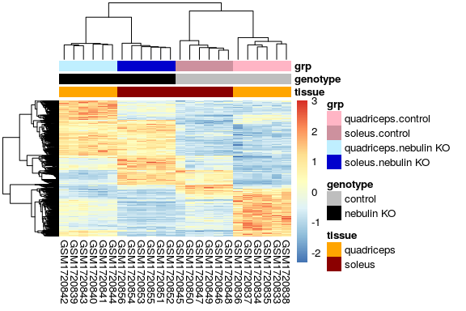

``` r
par(op)
```

**Take-home problem** (1)draw a plot with number of clusters in the x-axis and the average silhouette widths in the y-axis. Use the information obtained to determine if 5 was the best choice for the number of clusters.

(2)For a common choice of *k*, compare the clustering across different methods, e.g. hierarchical (pruned to specific *k*, obviously), k-means, PAM. You will re-discover the "label switching problem" for yourself. How does that manifest itself? How concordant are the clusterings for different methods?

Gene clustering
---------------

A different view at the data can be obtained from clustering genes instead of samples. Since clustering genes is slow when you have a lot of genes, for the sake of time we will work with a smaller subset of genes.

In many cases, analysts use cluster analysis to illustrate the results of a differential expression analysis. Sample clustering following a differential expression (DE) analysis will probably show the separation of the groups identified by the DE analysis. Thus, as it was mentioned in lectures, we need to be careful in over-interpreting these kind of results. However, note that it is valid to perform a gene clustering to see if differential expressed genes cluster according to their function, subcellular localizations, pathways, etc.

#### A smaller dataset

In [Seminar 6: Fitting and interpretting linear models (high volume)](http://stat540-ubc.github.io/sm06_highVolumeLinearModelling.html), you've learned how to use `limma` to fit a common linear model to a very large number of genes and thus identify genes that show differential expression over the course of development.

``` r
cutoff <- 1e-05
DesMat <- model.matrix(~grp, prDes)
dsFit <- lmFit(sprDat, DesMat)
dsEbFit <- eBayes(dsFit)
dsHits <- topTable(dsEbFit, coef = grep("grp", colnames(coef(dsEbFit))), p.value = cutoff, 
    n = Inf)
numBHhits <- nrow(dsHits)

topGenes <- rownames(dsHits)

# Scaled data of topGenes
topDat <- sprDat[topGenes, ]
```

We start by using different clustering algorithms to cluster the top 897 genes that showed differential expression across the different developmental stage (BH adjusted p value &lt; 10^{-5}).

#### Agglomerative Hierarchical Clustering

We can plot the heatmap using the `pheatmap` function....

``` r
pheatmap(topDat, cluster_rows = TRUE, scale = "none", clustering_method = "average", 
    clustering_distance_cols = "euclidean", clustering_distance_rows = "euclidean", 
    annotation = prDes[, c("tissue", "genotype", "grp")], show_rownames = FALSE, 
    annotation_colors = covar_color)
```

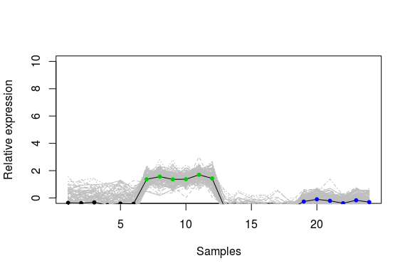

Or we can plot the heatmap using the `plot` function, after we have made the hclust object....

``` r
geneC.dis <- dist(topDat, method = "euclidean")

geneC.hc.a <- hclust(geneC.dis, method = "average")

plot(geneC.hc.a, labels = FALSE, main = "Hierarchical with Average Linkage", xlab = "")
```


As you can see, when there are lots of objects to cluster, the dendrograms are in general not very informative as it is difficult to identify any interesting pattern in the data.

#### Partitioning Methods

The most interesting thing to look at is the cluster centers (basically the "prototype" for the cluster) and membership sizes. Then we can try to visualize the genes that are in each cluster.

Let's visualize a cluster (remember the data were rescaled) using line plots. This makes sense since we also want to be able to see the cluster center.

``` r
set.seed(1234)
k <- 5
kmeans.genes <- kmeans(topDat, centers = k)

# choose which cluster we want
clusterNum <- 2

# Set up the axes without plotting; ylim set based on trial run.
plot(kmeans.genes$centers[clusterNum, ], ylim = c(0, 10), type = "n", xlab = "Samples", 
    ylab = "Relative expression")

# Plot the expression of all the genes in the selected cluster in grey.
matlines(y = t(topDat[kmeans.genes$cluster == clusterNum, ]), col = "grey")

# Add the cluster center. This is last so it isn't underneath the members
points(kmeans.genes$centers[clusterNum, ], type = "l")

# Optional: colored points to show which stage the samples are from.
points(kmeans.genes$centers[clusterNum, ], col = prDes$grp, pch = 20)
```

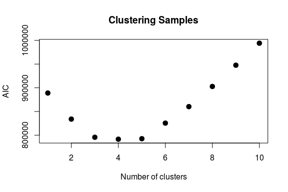

> Improve the plot above adding sample names to the x-axis (e.g., wt\_E16\_1)

Evaluating clusters
-------------------

### Choosing the right k

As mentioned in lecture 16, we need to find a balance between accurately grouping similar data into one representative cluster and the “cost” of adding additional clusters. Sometimes we don't have any prior knowledge to tell us how many clusters there are supposed to be in our data. In this case, we can use Akaike information criterion ([AIC](http://en.wikipedia.org/wiki/Akaike_information_criterion)) and Bayesian information criterion ([BIC](http://en.wikipedia.org/wiki/Bayesian_information_criterion)) to help us to choose a proper k.

First, we calculate the AIC for each choice of k. We are clustering the samples in this example:

``` r
set.seed(31)

k_max <- 10  # the max number of clusters to explore clustering with 
km_fit <- list()  # create empty list to store the kmeans object

for (i in 1:k_max) {
    k_cluster <- kmeans(t(sprDat), centers = i, nstart = 50)
    km_fit[[i]] <- k_cluster
}


# calculate AIC
km_AIC <- function(km_cluster) {
    m <- ncol(km_cluster$centers)
    n <- length(km_cluster$cluster)
    k <- nrow(km_cluster$centers)
    D <- km_cluster$tot.withinss
    return(D + 2 * m * k)
}
```

Then, we plot the AIC vs. the number of clusters. We want to choose the k value that corresponds to the elbow point on the AIC/BIC curve.

``` r
aic <- sapply(km_fit, km_AIC)
plot(seq(1, k_max), aic, xlab = "Number of clusters", ylab = "AIC", pch = 20, cex = 2, 
    main = "Clustering Samples")
```


Same for BIC

``` r
# calculate BIC
km_BIC <- function(km_cluster) {
    m <- ncol(km_cluster$centers)
    n <- length(km_cluster$cluster)
    k <- nrow(km_cluster$centers)
    D <- km_cluster$tot.withinss
    return(D + log(n) * m * k)
}

bic <- sapply(km_fit, km_BIC)
plot(seq(1, k_max), bic, xlab = "Number of clusters", ylab = "BIC", pch = 20, cex = 2, 
    main = "Clustering Samples")
```

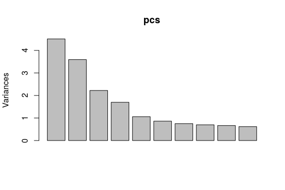

> Can you eyeball the optimal 'k' by looking at these plots?

The code for the section "Choosing the right k" is based on [Towers' blog](http://sherrytowers.com/2013/10/24/k-means-clustering/) and [this thread](http://stackoverflow.com/questions/15839774/how-to-calculate-bic-for-k-means-clustering-in-r)

### Statistical methods

An important issue for clustering is the question of certainty of the cluster membership. Clustering always gives you an answer, even if there aren't really any underlying clusters. There are many ways to address this. Here we introduce an approachable one offered in R, `pvclust`, which you can read about at (<http://www.sigmath.es.osaka-u.ac.jp/shimo-lab/prog/pvclust/>).

> Important: `pvclust` clusters the columns. I don't recommend doing this for genes! The computation will take a very long time. Even the following example with all 30K genes will take some time to run.

> You control how many bootstrap iterations `pvclust` does with the `nboot` parameter. We've also noted that `pvclust` causes problems on some machines, so if you have trouble with it, it's not critical.

Unlike picking the right clusters in the partition based methods (like k-means and PAM), here we are identifying the most stable clustering arising from hierarchichal clustering.

``` r
pvc <- pvclust(topDat, nboot = 100)
```

    ## Bootstrap (r = 0.5)... Done.
    ## Bootstrap (r = 0.6)... Done.
    ## Bootstrap (r = 0.7)... Done.
    ## Bootstrap (r = 0.8)... Done.
    ## Bootstrap (r = 0.9)... Done.
    ## Bootstrap (r = 1.0)... Done.
    ## Bootstrap (r = 1.1)... Done.
    ## Bootstrap (r = 1.2)... Done.
    ## Bootstrap (r = 1.3)... Done.
    ## Bootstrap (r = 1.4)... Done.

``` r
plot(pvc, labels = prDes$grp, cex = 0.6)
pvrect(pvc, alpha = 0.95)
```

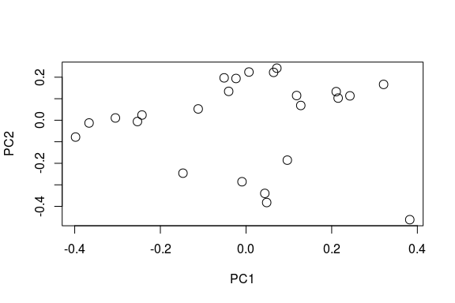

Feature reduction
-----------------

There are various ways to reduce the number of features (variables) being used in our clustering analyses. We have already shown how to subset the number of variables (genes) based on variance, calculated using the limma package.

### PCA plots

The other way we can do this is using PCA (principal components analysis). PCA assumes that the *most important* characteristics of our data are the ones with the largest variance. Furthermore, it takes our data and organizes it in such a way that redundancy is removed as the most important variables are listed first. The new variables will be linear combinations of the original variables, with different weights.

In R, we can use `prcomp()` to do PCA. You can also use `svd()`.

> Scaling is suppressed because we already scaled the rows. You can experiment with this to see what happens.

``` r
pcs <- prcomp(sprDat, center = FALSE, scale = FALSE)

# scree plot
plot(pcs)
```

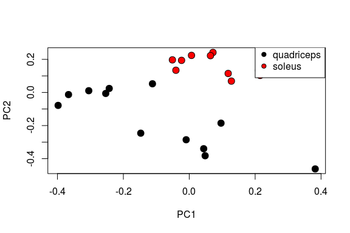

``` r
# append the rotations for the first 10 PCs to the phenodata
prinComp <- cbind(prDes, pcs$rotation[rownames(prDes), 1:10])

# scatter plot showing us how the first few PCs relate to covariates
plot(prinComp[, c("genotype", "tissue", "PC1", "PC2", "PC3")], pch = 19, cex = 0.8)
```


What does the samples spread look like, as explained by their first 2 principal components?

``` r
plot(prinComp[, c("PC1", "PC2")], pch = 21, cex = 1.5)
```

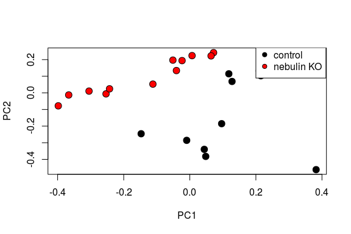

Is the covariate `tissue` localized in the different clusters we see?

``` r
plot(prinComp[, c("PC1", "PC2")], bg = prDes$tissue, pch = 21, cex = 1.5)
legend(list(x = 0.2, y = 0.3), as.character(levels(prDes$tissue)), pch = 21, pt.bg = c(1, 
    2, 3, 4, 5))
```


Is the covariate `genotype` localized in the different clusters we see?

``` r
plot(prinComp[, c("PC1", "PC2")], bg = prDes$genotype, pch = 21, cex = 1.5)
legend(list(x = 0.2, y = 0.3), as.character(levels(prDes$genotype)), pch = 21, pt.bg = c(1, 
    2, 3, 4, 5))
```


PCA is a useful initial means of analysing any hidden structures in your data. We can also use it to determine how many sources of variance are important, and how the different features interact to produce these sources.

First, let us first assess how much of the total variance is captured by each principal component.

``` r
# Get the subset of PCs that capture the most variance in your predictors
summary(pcs)
```

    ## Importance of components:
    ##                           PC1    PC2     PC3     PC4     PC5     PC6
    ## Standard deviation     2.1235 1.8957 1.49067 1.30336 1.02878 0.92795
    ## Proportion of Variance 0.1961 0.1562 0.09661 0.07386 0.04602 0.03744
    ## Cumulative Proportion  0.1961 0.3523 0.44890 0.52276 0.56877 0.60621
    ##                            PC7     PC8     PC9    PC10    PC11    PC12
    ## Standard deviation     0.86674 0.83534 0.81621 0.78678 0.77243 0.76143
    ## Proportion of Variance 0.03266 0.03034 0.02896 0.02691 0.02594 0.02521
    ## Cumulative Proportion  0.63887 0.66921 0.69817 0.72509 0.75103 0.77623
    ##                          PC13    PC14    PC15    PC16    PC17    PC18
    ## Standard deviation     0.7477 0.73139 0.72127 0.70872 0.69406 0.67519
    ## Proportion of Variance 0.0243 0.02326 0.02262 0.02184 0.02094 0.01982
    ## Cumulative Proportion  0.8005 0.82379 0.84641 0.86825 0.88919 0.90901
    ##                           PC19    PC20    PC21    PC22    PC23      PC24
    ## Standard deviation     0.67423 0.65740 0.64933 0.62812 0.62433 6.079e-15
    ## Proportion of Variance 0.01976 0.01879 0.01833 0.01715 0.01695 0.000e+00
    ## Cumulative Proportion  0.92878 0.94757 0.96590 0.98305 1.00000 1.000e+00

We see that the first two principal components capture 35% of the total variance. If we include the first 11 principal components, we capture 75% of the total variance.
Depending on which of these subsets you want to keep, we will select the rotated data from the first n components. We can use the `tol` parameter in `prcomp` to remove trailing PCs.

``` r
pcs_2dim = prcomp(sprDat, center = FALSE, scale = FALSE, tol = 0.8)
```

It is commonly seen a cluster analysis on the first 3 principal components to illustrate and explore the data.

### t-SNE plots

WHen we are dealing with datasets that have thousands of variables, and we want to have an initial pass at identifying hidden patterns in the data, another method we can use as an alterative to PCA is t-SNE. This method allows for non-linear interactions between our features.

Importantly, there are certain caveats with using t-SNE.
1. Solutions are not deterministic: While in PCA the *correct* solution to a question is guaranteed, t-SNE can have many multiple minima, and might give many different optimal solutions. It is hence non-deterministic. This may make it challenging to generate reproducible results.
2. Clusters are not intuitive: t-SNE collapses similar points in high dimensional space, on top of each other in lower dimensions. This means it maps features that are proximal to each other in a way that global trends may be warped. On the other hand, PCA always rotates our features in specific ways that can be extracted by considering the covariance matrix of our initial dataset and the eigenvectors in the new coordinate space.
3. Applying our fit to new data: t-SNE embedding is generated by moving all our data to a lower dimensional state. It does not give us eigenvectors (like PCA does) that can map new/unseen data to this lower dimensional state.

The computational costs of t-SNE are also quite expensive, and finding an embedding in lower space that makes sense may often require extensive fientuning of several hyperparameters.

We will be using the `Rtsne` package to visualize our data using t-SNE.
In this plot we are changing the perplexity parameter for the two different plots. As you see, the outputs are remarkably different.

``` r
# install.packages('Rtsne')
library(Rtsne)
```

    ## Warning: package 'Rtsne' was built under R version 3.3.3

``` r
colors = rainbow(length(unique(prDes$grp)))
names(colors) = unique(prDes$grp)
tsne <- Rtsne(unique(t(sprDat)), dims = 2, perplexity = 0.1, verbose = TRUE, max_iter = 100)
```

    ## Read the 24 x 24 data matrix successfully!
    ## Using no_dims = 2, perplexity = 0.100000, and theta = 0.500000
    ## Computing input similarities...
    ## Normalizing input...
    ## Perplexity should be lower than K!
    ## Building tree...
    ##  - point 0 of 24
    ## Done in 0.00 seconds (sparsity = 0.000000)!
    ## Learning embedding...
    ## Iteration 50: error is 0.000000 (50 iterations in 0.01 seconds)
    ## Iteration 100: error is 0.000000 (50 iterations in 0.00 seconds)
    ## Fitting performed in 0.01 seconds.

``` r
plot(tsne$Y, main = "tsne")
text(tsne$Y, labels = prDes$grp, col = colors[prDes$grp])
```


``` r
tsne_p1 <- Rtsne(unique(t(sprDat)), dims = 2, perplexity = 1, verbose = TRUE, max_iter = 100)
```

    ## Read the 24 x 24 data matrix successfully!
    ## Using no_dims = 2, perplexity = 1.000000, and theta = 0.500000
    ## Computing input similarities...
    ## Normalizing input...
    ## Building tree...
    ##  - point 0 of 24
    ## Done in 0.00 seconds (sparsity = 0.163194)!
    ## Learning embedding...
    ## Iteration 50: error is 58.920558 (50 iterations in 0.00 seconds)
    ## Iteration 100: error is 63.550261 (50 iterations in 0.00 seconds)
    ## Fitting performed in 0.00 seconds.

``` r
plot(tsne_p1$Y, main = "tsne")
text(tsne_p1$Y, labels = prDes$grp, col = colors[prDes$grp])
```


Deliverables
------------

-   Regenerate the pheatmap clustering plot for the top genes, selected from limma, using clustering distance: correlation, and clustering method: mcquitty.
-   Regenerate the plots in this document using `lattice` and/or `ggplot2`.
